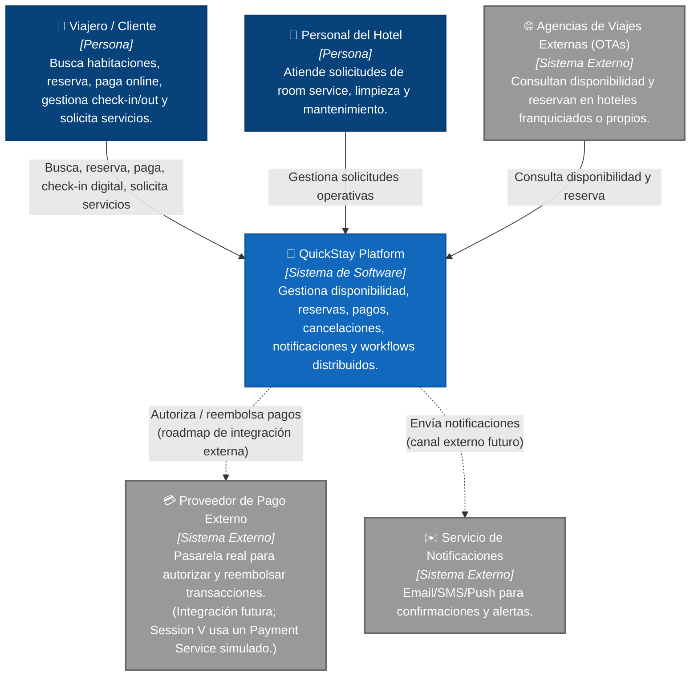
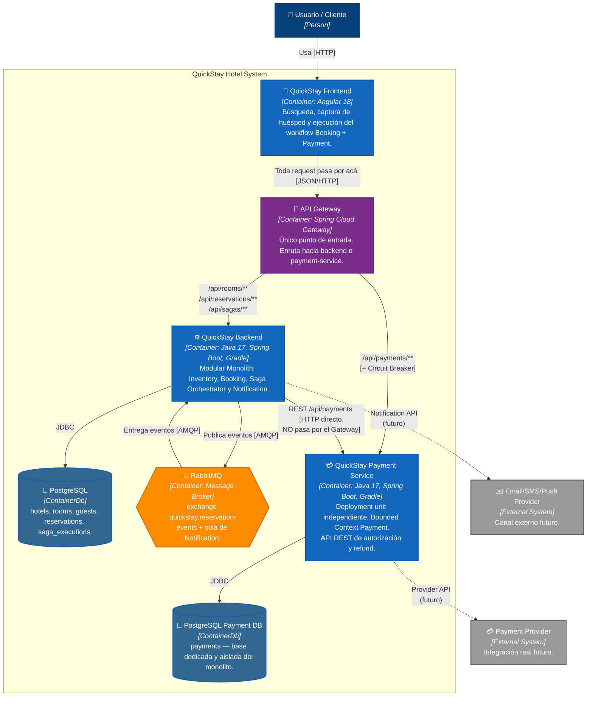
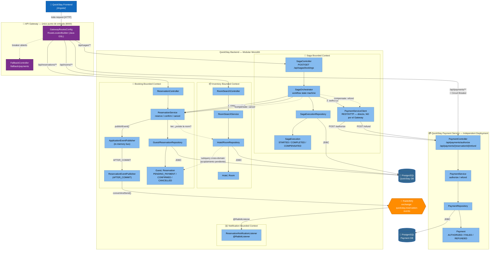
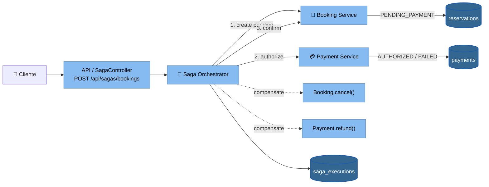
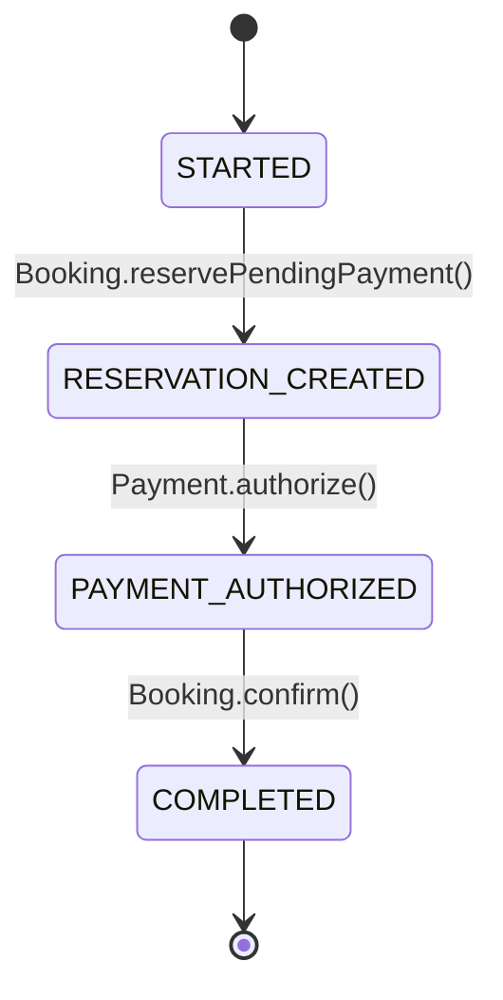
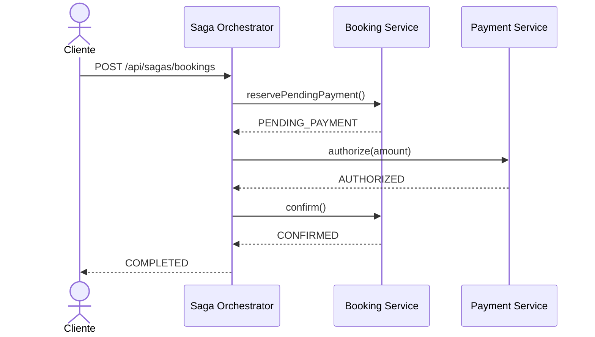
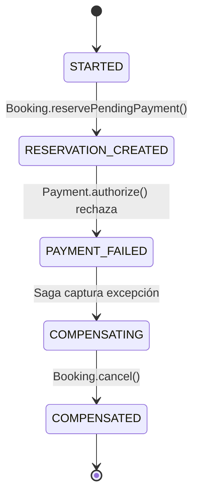
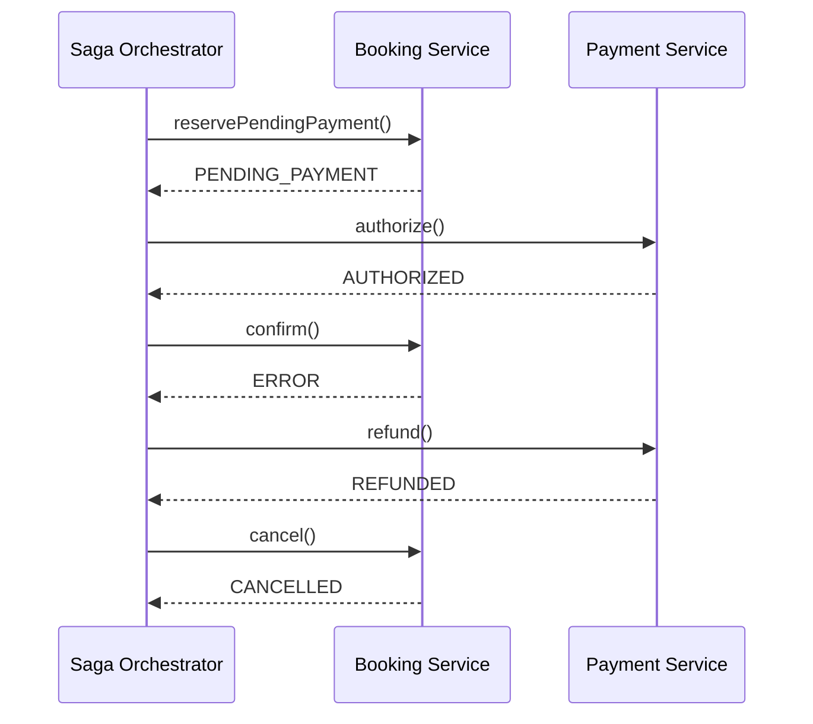
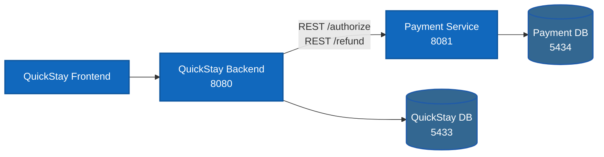
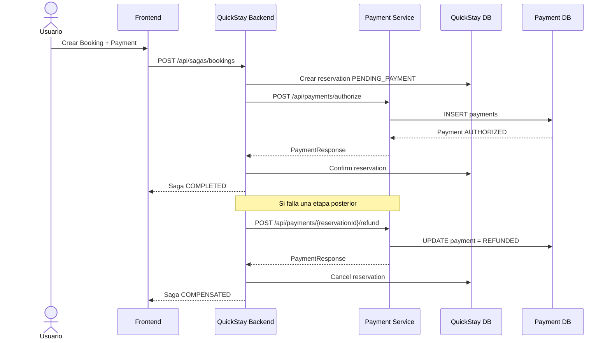

# QuickStay Hotel Platform

## 🎯 Objetivo de la kata
Desarrollar una plataforma de reservas hoteleras que permita buscar disponibilidad,
reservar, pagar, gestionar check-in/out digital y recibir promociones — evolucionando
progresivamente su arquitectura a lo largo de las 8 sesiones del módulo
*Microservices, Event-Driven and Cloud-Native*.

---

# 1era Actividad — Choose a Software Architecture Kata
**QuickStay Hotel Platform**

## Description
A hotel group wants to create a booking platform for its hotels. Customers can search
availability, reserve rooms, pay online, check in digitally, request services, and
receive promotions.

## Users
Potentially millions of travelers across regions.

## Requirements
- Allow users to search rooms by location, date, price, and amenities.
- Allow users to reserve a room.
- Allow users to pay online or at the hotel.
- Allow users to cancel or modify reservations.
- Support loyalty points.
- Support national promotions.
- Support hotel-specific promotions.
- Allow digital check-in and check-out.
- Allow users to request room service, housekeeping, or maintenance.
- Notify customers about booking confirmation, reminders, and changes.
- Integrate with external travel agencies.
- Integrate with payment providers.
- Support mobile access.

## Additional Context
- Some hotels are owned by the company; others are franchises.
- Room availability changes constantly.
- Third-party booking platforms may reserve rooms too.
- Overbooking must be avoided or carefully managed.
- Cancellations may have different policies.
- Future expansion includes multiple countries and currencies.

---

# 2da Actividad — Build the Monolith Core (Sesión II)

Se construyó un **monolito en capas** puro (separado por rol técnico:
presentation → service → repository → domain), sin separación por dominio
de negocio todavía. Ese fue el punto de partida intencional — ver el
refactor hacia dominios en la Sesión III, más abajo.

### Alcance funcional (sigue vigente)
- ✅ Búsqueda de disponibilidad por ciudad, fechas y precio máximo
- ✅ Reserva de habitación con validación de solapamiento (anti-overbooking
  básico, dentro de una única transacción)
- ✅ Cancelación de reserva
- ✅ Alta automática de huésped al reservar
- ⏳ Pago online, loyalty, promociones, check-in digital, notificaciones,
  integración con OTAs → planificado para sesiones posteriores

---

# 3ra Actividad — Structural Variation Styles (Sesión III)

**Actividades:** *Conduct an architectural review of the initial monolith*
+ *Refactor the code into strict domain packages/namespaces*.

Ver el detalle completo de la revisión y las decisiones de diseño en
[`docs/session-03-evaluation.md`](docs/session-03-evaluation.md).

## 🏛️ Arquitectura actual: Modular Monolith (Bounded Contexts)

El código se reorganizó de capas técnicas a **paquetes por dominio de
negocio**. Sigue siendo un único deployable con una única base de datos
(todavía no es microservicios), pero cada dominio ya es internamente
cohesivo y sus límites están explícitos en el código.

```
quickstay-hotel-platform/
├── backend/                          Spring Boot (Java 17, Gradle Groovy)
│   └── src/main/java/com/quickstay/
│       ├── inventory/                Bounded Context: Hoteles y habitaciones
│       │   ├── domain/       Hotel, Room, HotelOwnershipType
│       │   ├── repository/   HotelRepository, RoomRepository
│       │   ├── service/      RoomSearchService
│       │   ├── web/          RoomSearchController
│       │   └── dto/          RoomSearchRequest, RoomAvailabilityResponse
│       │
│       ├── booking/                  Bounded Context: Huéspedes y reservas
│       │   ├── domain/       Guest, Reservation, ReservationStatus
│       │   ├── repository/   GuestRepository, ReservationRepository
│       │   ├── service/      ReservationService
│       │   ├── web/          ReservationController
│       │   ├── dto/          ReservationRequest, ReservationResponse
│       │   └── exception/    RoomNotAvailableException
│       │
│       └── shared/                   Cross-cutting
│           └── exception/    GlobalExceptionHandler
│
├── frontend/quickstay-web/           Angular 18 (standalone components) — sin cambios
├── infra/                            docker-compose (PostgreSQL) — sin cambios
└── docs/
    └── session-03-evaluation.md      Revisión arquitectónica + justificación del refactor
```

### Cambio de diseño clave
`Reservation` ya **no** mapea `Room` como relación JPA (`@ManyToOne`) —
ahora guarda solo `roomId: UUID`. Esto evita que el dominio Booking cargue
por accidente el grafo de entidades de Inventory, preservando el límite del
Bounded Context aunque ambas tablas sigan en la misma base de datos física.
Detalle completo en `docs/session-03-evaluation.md`.

### Principios de esta sesión
- **Bounded Contexts explícitos en el código**, no solo en la cabeza del
  equipo.
- **Un solo deployable y una sola base de datos** — la modularización es de
  código, todavía no de infraestructura (eso empieza en Sesión VI).
- Acoplamiento cross-dominio que queda **documentado como decisión
  consciente**, no eliminado del todo (se resuelve con eventos en Sesión IV
  y CQRS en Sesión VIII).

---

# 4ta Actividad — Enterprise Integration & Messaging (Sesión IV)

**Actividades:** *Map Out Domain Events* + *Wire an In-Memory Event Bus* +
*Refactor the event bus to use an external message broker (RabbitMQ)*.

Ver el detalle completo en:
- [`docs/session-04-domain-events.md`](docs/session-04-domain-events.md) — catálogo de eventos
- [`docs/session-04-evaluation.md`](docs/session-04-evaluation.md) — evaluación arquitectónica

## 🔀 De llamada síncrona a mensajería asíncrona

Nace el Bounded Context **Notification**. Booking ya no lo conocería aunque
quisiera: se comunican exclusivamente a través de RabbitMQ.

```
booking/
├── event/                 Domain events internos (in-memory)
│   ├── ReservationConfirmedEvent
│   └── ReservationCancelledEvent
└── messaging/              Infraestructura: traduce domain event → mensaje externo
    ├── ReservationIntegrationEvent   (contrato de mensaje, wire format)
    ├── BookingMessagingConfig        (declara el exchange RabbitMQ)
    └── ReservationEventPublisher     (@TransactionalEventListener AFTER_COMMIT)

notification/
└── messaging/
    ├── ReservationEventMessage       (copia propia del contrato — sin importar booking)
    ├── NotificationMessagingConfig   (declara su propia cola + binding)
    └── ReservationNotificationListener (@RabbitListener — logea la "notificación")

shared/
└── messaging/
    └── RabbitMqConfig                (converter JSON compartido)
```

### Flujo
1. `ReservationService.reserve()` guarda la reserva y publica
   `ReservationConfirmedEvent` en memoria (bus de Spring).
2. `ReservationEventPublisher` escucha ese evento, pero solo actúa
   **después de que la transacción confirma** (`AFTER_COMMIT`) — si la
   reserva falla, nunca sale ningún mensaje.
3. El mensaje llega a RabbitMQ, al exchange `quickstay.reservation-events`.
4. `ReservationNotificationListener` (dominio Notification, sin ningún
   import de `booking`) lo consume de su propia cola y "envía" la
   notificación (por ahora, solo logging — el canal real de email/SMS
   queda fuera de alcance de este módulo).

### Por qué el cliente HTTP no espera la notificación
La reserva se confirma y responde `201 Created` de inmediato. La
notificación llega con **consistencia eventual** — normalmente milisegundos
después, pero desacoplada del tiempo de respuesta de la API. Detalle
completo del trade-off en `docs/session-04-evaluation.md`.

---

## 📦 Tecnologías

| Capa | Tecnología |
|------|------------|
| **Backend** | Java 17, Spring Boot 3.3.2, Gradle 8.8 (Groovy DSL), Spring Data JPA, Spring AMQP, Flyway, Lombok, PostgreSQL driver |
| **Payment Service** | Java 17, Spring Boot 3.3.2, Gradle 8.8, Spring Data JPA, Flyway, PostgreSQL driver |
| **Mensajería** | RabbitMQ 3 (management UI incluida) |
| **Frontend** | Angular 18 (standalone components), TypeScript, SCSS |
| **Base de datos** | PostgreSQL 16 (Docker): QuickStay DB + Payment DB aislada |
| **Gestión de dependencias** | Gradle (backend) & npm (frontend) |
| **Control de versiones** | Git — rama + tag por sesión |

---

# 🏨 Arquitectura de Software (C4 Model)

Los diagramas C4 se mantienen con el mismo lenguaje visual de las sesiones
anteriores: **azul para personas/sistemas/contenedores propios, gris para
sistemas externos o componentes futuros, azul oscuro para persistencia y
naranja para RabbitMQ**. La diferencia es que ahora reflejan el estado real
hasta **Sesión V**, incluyendo Payment y el Saga Orchestrator.

## 📌 Nivel 1: Diagrama de Contexto



> **Estado a Sesión V:** QuickStay ya contiene internamente los bounded
> contexts/módulos `Booking`, `Payment`, `Saga` y `Notification`. El proveedor
> de pago externo del Nivel 1 continúa siendo un sistema de integración
> futura: para demostrar la actividad de Saga, `PaymentService` simula ese
> proveedor dentro del backend. La notificación también mantiene un stub de
> logging detrás de RabbitMQ.

## 📦 Nivel 2: Diagrama de Contenedores (Sesión VII)



> **Evolución de Sesión VI → VII:** el frontend deja de hablarle directo al
> backend (`8080`). Ahora todo pasa por el **API Gateway** (`8000`), que
> decide según el path si la request va al monolito o al microservicio de
> Payment. La llamada interna `Saga → Payment` (línea punteada "NO pasa por
> el Gateway" en el diagrama) sigue siendo directa — el Gateway resuelve
> tráfico norte-sur (cliente → sistema), no este-oeste (servicio → servicio).
> Ver `docs/session-07-evaluation.md`.

### Cambios de la Sesión VI en el Nivel 2

- Se extrae físicamente el **Payment Bounded Context** a `payment-service/`.
- `QuickStay Backend` conserva `Booking`, `Inventory`, `Saga` y `Notification`.
- `Payment Service` tiene despliegue, puerto (`8081`) y ciclo de vida propios.
- Se crea una **base PostgreSQL dedicada** `quickstay_payment` en el puerto `5434`.
- La tabla `payments` deja de existir en la base del monolito mediante
  `V4__extract_payment_context.sql`.
- La comunicación `Saga → Payment` pasa a ser **REST/HTTP**.
- La compensación `refund` sigue siendo parte del workflow Saga.

### Cambios de la Sesión VII en el Nivel 2

- Nace **`api-gateway/`** (Spring Cloud Gateway), único punto de entrada
  público en el puerto `8000`.
- El **frontend** ahora apunta a `http://localhost:8000` en vez de
  `http://localhost:8080` (`environment.ts`).
- Rutas hacia el monolito (`/api/rooms/**`, `/api/reservations/**`,
  `/api/sagas/**`): sin Circuit Breaker — si el monolito cae, cae todo el
  sistema de todas formas.
- Ruta hacia Payment (`/api/payments/**`): **con Circuit Breaker**
  (Resilience4j) — Payment es el componente aislado con mayor probabilidad
  de fallar de forma independiente.
- CORS se centraliza en el Gateway (`spring.cloud.gateway.globalcors`); el
  `CorsConfig` del backend queda vigente solo para pruebas directas sin
  pasar por el Gateway.

## 🧩 Nivel 3: Diagrama de Componentes — Bounded Contexts + Messaging + Saga + Extracted Payment + API Gateway



> **Bounded Context:** Payment ya no comparte entidades, repositorios ni
> tablas con Booking. El único contrato entre ambos contextos es la API del
> `Payment Service`, consumida por `PaymentServiceClient`. La `reservationId`
> se intercambia como identificador de negocio, sin FK física entre bases.
>
> **API Gateway (Sesión VII):** notá que `paymentClient` (dentro del Saga)
> le sigue hablando a `PaymentService` **directo**, no a través de
> `gwRoutes` — el Gateway resuelve tráfico cliente-externo→sistema, no
> comunicación interna servicio-a-servicio. Ver
> `docs/session-07-evaluation.md`.

# 🔄 Session V — Service-Based & Orchestrated Styles

## 🎯 Actividad implementada

> **Create a multi-service workflow (booking/payment/shipping) using the Saga
> Pattern — Orchestration.**

En QuickStay el caso equivalente es **Booking + Payment**, coordinados por un
`SagaOrchestrator`. La solución conserva la arquitectura modular de las
sesiones anteriores y prepara la futura extracción de cada módulo como
servicio desplegable independiente.

### 🏗️ Arquitectura de la Saga



## 🟢 Happy Path



### Secuencia del workflow exitoso



## 🔴 Partial Failure + Compensación



Cuando el pago falla, la habitación no queda bloqueada por una reserva
pendiente: el Orchestrator ejecuta `Booking.cancel()` como acción
compensatoria.

Si el pago ya fue autorizado y falla la confirmación posterior:



## 📊 Estados persistidos

| Componente | Estado normal | Estado ante compensación |
|---|---|---|
| **Booking** | `PENDING_PAYMENT → CONFIRMED` | `CANCELLED` |
| **Payment** | `AUTHORIZED` | `REFUNDED` |
| **Saga** | `STARTED → COMPLETED` | `COMPENSATED` |

La consistencia es **eventual y basada en acciones compensatorias**. No se
utiliza una transacción distribuida ACID entre Booking y Payment.

## 🔌 API de la Saga

### Crear Booking + Payment

`POST /api/sagas/bookings`

```json
{
  "reservation": {
    "roomId": "33333333-3333-3333-3333-333333333333",
    "guestFullName": "Ana Perez",
    "guestEmail": "ana@example.com",
    "checkIn": "2026-09-01",
    "checkOut": "2026-09-05"
  },
  "paymentAmount": 1400.00,
  "failPayment": false
}
```

`paymentAmount` representa el total de la estadía y se calcula en el frontend
como `pricePerNight × noches`.

### Probar la compensación

Enviar el mismo payload con:

```json
"failPayment": true
```

El `PaymentService` crea el intento con estado `FAILED`, el Orchestrator
captura la excepción y ejecuta `Booking.cancel()`. La Saga queda persistida
como `COMPENSATED`.

### Consultar una Saga

`GET /api/sagas/bookings/{sagaId}`

Permite inspeccionar el estado persistido, el paso actual, la reserva
relacionada y el último error registrado.

## 🖥️ Evidencia visible en la UI

La aplicación Angular incorpora el checkbox **“Simular fallo de pago”** en el
flujo de reserva. Esto permite demostrar directamente:

1. **Happy path:** Booking → Payment → Booking confirmation.
2. **Partial failure:** Booking → Payment failure → automatic compensation.

La respuesta muestra el `sagaId`, el estado de la Saga y el importe procesado.

## 🧠 Decisiones de diseño de la Session V

- **Orchestration:** el `SagaOrchestrator` conoce el orden del workflow y las
  acciones compensatorias.
- **Sin transacción distribuida:** cada bounded context mantiene su propia
  operación local.
- **Compensación explícita:** `Booking.cancel()` y `Payment.refund()` son
  operaciones de negocio, no simples rollbacks de base de datos.
- **Estados persistidos:** `saga_executions` permite auditar el progreso y
  detectar dónde falló el proceso.
- **Idempotencia básica:** Payment reutiliza un pago autorizado existente para
  evitar duplicaciones en reintentos simples.
- **Fallos parciales:** si Payment falla después de crear la reserva temporal,
  Booking queda compensado automáticamente.
- **Preparado para extracción:** `Booking`, `Payment` y `Saga` pueden
  convertirse posteriormente en `booking-service`, `payment-service` y
  `saga-orchestrator` independientes.
- **RabbitMQ se conserva:** los eventos de confirmación/cancelación siguen
  alimentando Notification de forma asíncrona, como se implementó en Sesión IV.

## 🔬 Session VI — Microservices Deep Dive

## 🎯 Actividad implementada

**Proyecto:** extraer físicamente un dominio modular a una unidad de despliegue
independiente con una instancia de base de datos dedicada y aislada.

Se seleccionó el **Payment Bounded Context**, porque ya estaba delimitado en
la Sesión V y participa directamente en el workflow Saga. La extracción evita
convertir la sesión en una reescritura completa del sistema: se aplica el
principio de **strangler extraction**, preservando Booking y Saga dentro del
monolito mientras Payment obtiene su propio proceso y almacenamiento.

### 🧱 Resultado arquitectónico



### 🔐 Data Isolation

| Antes (Sesión V) | Después (Sesión VI) |
|---|---|
| `payments` dentro de `quickstay` | `payments` dentro de `quickstay_payment` |
| Backend accedía directamente a `PaymentRepository` | Backend usa `PaymentServiceClient` |
| Una sola instancia PostgreSQL | Dos instancias PostgreSQL |
| Mismo proceso JVM | Dos procesos JVM desplegables |
| FK `payments.reservation_id → reservations.id` | Solo `reservationId` como identificador de negocio |

### 🔄 Flujo distribuido



## 🧭 Bounded Context extraído: Payment

El nuevo `payment-service` contiene exclusivamente:

- `Payment` y `PaymentStatus`.
- `PaymentRepository`.
- `PaymentService`.
- `PaymentController`.
- DTOs propios del contexto.
- Flyway propio (`payment-service/src/main/resources/db/migration`).
- Configuración propia de datasource y puerto.

El monolito ya **no contiene** el paquete `com.quickstay.payment`. Esto es
importante: la extracción es física y no solamente un cambio cosmético de
paquetes.

## 🔌 API del Payment Service

### Autorizar pago

`POST http://localhost:8081/api/payments/authorize`

```json
{
  "reservationId": "<UUID>",
  "amount": 450.00,
  "failPayment": false
}
```

### Reembolsar pago

`POST http://localhost:8081/api/payments/{reservationId}/refund`

El endpoint es idempotente para pagos que ya estén en `REFUNDED`.

### Health check

`GET http://localhost:8081/api/payments/health`

## 🗄️ Bases de datos aisladas

### QuickStay DB — `5433`

Contiene los datos de `Inventory`, `Booking` y `Saga`, incluyendo:

- `hotels`
- `rooms`
- `guests`
- `reservations`
- `saga_executions`

La migración `V4__extract_payment_context.sql` elimina la tabla `payments` del
esquema del monolito.

### Payment DB — `5434`

Contiene únicamente el almacenamiento del Payment Service:

- `payments`

No existe FK física hacia `reservations`. El aislamiento entre bounded
contexts se mantiene mediante el `reservationId` intercambiado por API.

## 🐳 Ejecución local

### 1. Levantar infraestructura

Desde `infra/`:

```bash
docker compose up -d
```

Se levantan dos PostgreSQL independientes:

- QuickStay DB → `localhost:5433`
- Payment DB → `localhost:5434`
- RabbitMQ → `localhost:5672`

### 2. Levantar QuickStay Backend

```bash
cd backend
./gradlew bootRun
```

Queda disponible en `http://localhost:8080`.

### 3. Levantar Payment Service

En otra terminal:

```bash
cd payment-service
./gradlew bootRun
```

Queda disponible en `http://localhost:8081`.

Si se requiere otra URL:

```bash
PAYMENT_SERVICE_URL=http://host:8081 ./gradlew bootRun
```

## 🧪 Evidencia de la extracción

Para comprobar que la separación es real:

1. Arrancar ambas aplicaciones.
2. Ejecutar un Booking + Payment desde el frontend.
3. Verificar que `saga_executions` se crea en QuickStay DB.
4. Verificar que `payments` se crea en Payment DB.
5. Detener `payment-service` y repetir la operación: el Saga detectará el fallo
   parcial y ejecutará la compensación de Booking.
6. Arrancar nuevamente Payment Service y comprobar que la siguiente operación
   funciona sin modificar el backend.

## 🧠 Decisiones de diseño de la Session VI

### ¿Por qué extraer Payment?

Es el bounded context más natural para una primera extracción: tiene límites
claros, persistencia propia y un contrato sencillo. Además, ya participa en la
Saga de Session V, por lo que la transición demuestra una consecuencia real de
pasar de modular monolith a microservice.

### ¿Por qué REST y no RabbitMQ?

La Saga actual requiere una respuesta inmediata para saber si la autorización
fue exitosa antes de confirmar la reserva. REST mantiene esa semántica síncrona
y hace visible el nuevo límite de despliegue. RabbitMQ continúa reservado para
la integración asíncrona de notificaciones.

### ¿Y CQRS?

La competencia de la unidad menciona CQRS, pero la actividad práctica de esta
sesión exige específicamente **extraer un dominio con deployment y base
aislados**. No se introduce CQRS artificialmente donde el perfil de carga no lo
justifica. La separación física deja preparado el terreno para que una futura
optimización de lecturas pueda usar un modelo/query store independiente si la
telemetría real demuestra esa necesidad.

### Trade-off

**Ganancia:** aislamiento de datos, despliegue independiente y posibilidad de
escalar Payment por separado.

**Costo:** comunicación de red, configuración distribuida, dos ciclos de
despliegue, observabilidad adicional y nuevos puntos de fallo.

# 🚪 Session VII — Advanced Distributed Architectures: API Gateway

## 🎯 Actividad implementada

*Deploy an API Gateway to act as the single entry point for clients,
routing incoming requests seamlessly to either the new microservice or the
remaining monolith.*

Nace **`api-gateway/`** — un tercer deployable (Spring Cloud Gateway,
puerto `8000`), que se convierte en el único punto de entrada público del
sistema. El frontend deja de hablarle directo al backend.

## 🗺️ Rutas configuradas

| Path | Destino | Circuit Breaker |
|---|---|---|
| `/api/rooms/**` | `quickstay-backend` | No |
| `/api/reservations/**` | `quickstay-backend` | No |
| `/api/sagas/**` | `quickstay-backend` | No |
| `/api/payments/**` | `quickstay-payment-service` | **Sí** (Resilience4j) |

Configuración de rutas en `api-gateway/src/main/java/com/quickstay/gateway/config/GatewayRoutesConfig.java`
(DSL Java de Spring Cloud Gateway, vía `RouteLocatorBuilder`) — se prefirió
código sobre YAML para que el compilador valide la sintaxis de cada ruta y
filtro, en vez de descubrir un typo recién en tiempo de ejecución. El
`application.yml` del Gateway solo tiene configuración (CORS, puertos,
umbrales del Circuit Breaker), no las rutas en sí.

## 🔌 Circuit Breaker sobre Payment

Si `payment-service` está caído, lento, o falla por encima del umbral
configurado (`failure-rate-threshold: 50` sobre una ventana de 10 llamadas),
el Gateway deja de reenviarle tráfico y responde inmediatamente con `503`
vía `FallbackController`, en vez de dejar al cliente esperando un timeout.

Estado del breaker en vivo: `http://localhost:8000/actuator/circuitbreakers`.

Detalle completo de la relación entre este Circuit Breaker y la
compensación del Saga (son mecanismos de resiliencia distintos, en capas
distintas) en `docs/session-07-evaluation.md`.

## 🧠 Decisiones de diseño de la Session VII

### ¿Por qué el Saga sigue llamando a Payment directo, sin pasar por el Gateway?

El API Gateway resuelve tráfico **norte-sur** (cliente externo → sistema).
La llamada `SagaOrchestrator → PaymentServiceClient` es **este-oeste**
(servicio → servicio, interna al sistema) — pasarla por el Gateway no
aportaría nada y agregaría un salto de red innecesario. Ver
`docs/session-07-evaluation.md` para el detalle completo.

### ¿Por qué Circuit Breaker solo en la ruta de Payment?

Las rutas hacia el monolito no lo necesitan tanto: si el monolito cae, cae
todo el sistema igual (Inventory, Booking y Saga viven ahí). Payment, en
cambio, es un fallo aislado real — el sistema puede seguir funcionando
parcialmente (buscar habitaciones, por ejemplo) aunque Payment esté caído.

### Trade-off

**Ganancia:** el frontend (y cualquier cliente futuro — app mobile, un
partner externo) tiene un único endpoint estable, sin importar cuántos
servicios haya detrás ni cómo cambien sus URLs internas. Resiliencia
explícita ante la caída del componente más nuevo del sistema.

**Costo:** un deployable más para operar, un salto de red adicional en cada
request del cliente, y un nuevo punto único de falla (si el Gateway cae,
cae el acceso a todo el sistema) — que en un entorno productivo se mitiga
corriendo múltiples réplicas del Gateway detrás de un load balancer, fuera
del alcance de este módulo.

# 📚 Documentación por sesión

| Sesión | Arquitectura / foco | Documentación |
|---|---|---|
| III | Modular Monolith + Bounded Contexts | `docs/session-03-evaluation.md` |
| IV | Enterprise Integration & Messaging | `docs/session-04-domain-events.md` · `docs/session-04-evaluation.md` |
| V | Service-Based & Orchestrated Styles — Saga | `docs/session-05-saga-evaluation.md` |
| VI | Microservices Deep Dive — Payment extraction + Data Isolation | `docs/session-06-microservices-extraction.md` |
| VII | Advanced Distributed Architectures — API Gateway + Circuit Breaker | `docs/session-07-evaluation.md` |

## 🚀 Cómo levantar el entorno local

### 1. Infraestructura (PostgreSQL + RabbitMQ vía Docker)

> Nota: si ya tenés un PostgreSQL nativo corriendo en tu máquina (Windows/Mac),
> puede ocupar el puerto 5432. Este proyecto usa los puertos **5433** y **5434**
> en el host para las dos bases PostgreSQL aisladas (ver `infra/docker-compose.yml`).

```bash
cd infra
docker compose up -d
docker ps   # confirmar quickstay-postgres, quickstay-payment-postgres, pgadmin y quickstay-rabbitmq
```

Credenciales:
- PostgreSQL QuickStay: DB `quickstay`, user/pass `quickstay`/`quickstay` (puerto 5433)
- PostgreSQL Payment: DB `quickstay_payment`, user/pass `quickstay_payment`/`quickstay_payment` (puerto 5434)
- RabbitMQ: user/pass `quickstay`/`quickstay` (puerto 5672 AMQP, 15672 management UI)

Management UI de RabbitMQ: `http://localhost:15672` — útil para ver el
exchange `quickstay.reservation-events` y la cola
`notification.reservation-events` en tiempo real.

### 2. Backend (monolito)

```bash
cd backend
./gradlew bootRun        # Windows: .\gradlew.bat bootRun
```

Al arrancar, Flyway crea el schema y carga datos demo automáticamente
(`V1__init_schema.sql`, `V2__seed_demo_data.sql`). La API queda en
`http://localhost:8080`.

**Nota:** el proceso queda corriendo en foreground (no "termina" — la barra de
progreso de Gradle se queda fija, eso es normal). Confirmá que levantó bien
buscando en el log: `Started QuickstayApplication in X seconds`.

Endpoints disponibles:
```
GET  /api/rooms/search?city={city}&checkIn={yyyy-MM-dd}&checkOut={yyyy-MM-dd}&maxPrice={decimal}
POST /api/reservations
POST /api/reservations/{id}/cancel
POST /api/sagas/bookings
GET  /api/sagas/bookings/{sagaId}
```

### 3. Payment Service (microservicio)

En otra terminal:

```bash
cd payment-service
./gradlew bootRun        # Windows: .\gradlew.bat bootRun
```

Queda disponible en `http://localhost:8081`. El backend lo llama
directamente vía `PAYMENT_SERVICE_URL` (default `http://127.0.0.1:8081`) —
no hace falta configurar nada extra si corrés todo en `localhost`.

### 4. API Gateway (Sesión VII — punto de entrada único)

En otra terminal:

```bash
cd api-gateway
./gradlew bootRun        # Windows: .\gradlew.bat bootRun
```

Queda disponible en `http://localhost:8000`. A partir de esta sesión, es el
**único** endpoint que el frontend (y cualquier cliente externo) debería
usar — enruta automáticamente hacia `backend` o `payment-service` según el
path (ver `docs/session-07-evaluation.md`).

Confirmá que las rutas se registraron bien:
```
http://localhost:8000/                          → info de cortesía + mapa de rutas
http://localhost:8000/actuator/gateway/routes    → detalle real de rutas registradas
```

### 5. Frontend

```bash
cd frontend/quickstay-web
npm install
npm start
```

Se levanta en `http://localhost:4200`, ya conectado al **Gateway**
(`src/environments/environment.ts` → `http://localhost:8000`), no al
backend directamente.

### 6. Verificar

- `http://localhost:4200` → formulario de búsqueda, reserva y pago (Saga),
  todo pasando por el Gateway.
- `http://localhost:8000/api/rooms/search?...` → JSON con habitaciones,
  enrutado por el Gateway hacia el backend (ver ejemplo abajo).
- `http://localhost:8000/actuator/circuitbreakers` → estado del Circuit
  Breaker de la ruta de Payment.

Ejemplo de búsqueda vía Gateway:
```
http://localhost:8000/api/rooms/search?city=La%20Paz&checkIn=2026-09-01&checkOut=2026-09-05&maxPrice=600
```

> Los backends siguen siendo alcanzables directo en `8080`/`8081` para
> debugging puntual, pero el flujo "real" del sistema, a partir de esta
> sesión, es siempre a través del Gateway (`8000`).

---

## 🧪 Troubleshooting rápido

| Síntoma | Causa probable | Solución |
|---|---|---|
| `FATAL: la autentificación password falló` | Volumen de Postgres viejo con otras credenciales, o conflicto de puerto con un Postgres nativo | `docker compose down -v && docker compose up -d` |
| `Unable to determine Dialect without JDBC metadata` | Backend no logra conectar a la DB (mensaje real de Hibernate queda oculto) | Verificar `docker ps` y el puerto en `application.yml` |
| Barra de Gradle se queda en 80-90% | Comportamiento normal de `bootRun` — el proceso queda vivo sirviendo peticiones | Buscar `Started QuickstayApplication` en el log |
| `blocked by CORS policy` en la consola del navegador, request marcado `net::ERR_FAILED` (pero sin error en el log del backend) | El browser bloquea la respuesta porque el backend no declara `http://localhost:4200` como origen permitido | Ya resuelto vía `shared/config/CorsConfig.java` — si cambiás el puerto del frontend, actualizá `allowedOrigins` ahí |
| Backend no arranca: `Connection refused` apuntando a `5672` | RabbitMQ no está corriendo | `docker ps` y confirmar `quickstay-rabbitmq` está `Up`; si no, `docker compose up -d` desde `infra/` |
| No aparece el log `[NOTIFICATION] Enviando email...` tras reservar | El listener no está conectado a la cola, o el mensaje no llegó | Revisar `http://localhost:15672` → pestaña *Queues* → `notification.reservation-events`: si el mensaje quedó "Ready" sin consumir, el backend probablemente no levantó bien el `@RabbitListener` (ver log al arrancar) |
| El frontend tira errores de red / CORS después de esta sesión | Sigue apuntando al backend directo (`8080`) en vez del Gateway (`8000`) | Confirmar `frontend/quickstay-web/src/environments/environment.ts` → `apiUrl: 'http://localhost:8000'`, y que `api-gateway` esté corriendo |
| `503 Service Unavailable` al pagar, con mensaje de `FallbackController` | El Circuit Breaker de la ruta de Payment está abierto — `payment-service` está caído o viene fallando por encima del umbral | Confirmar `payment-service` está `Up` (`docker ps` o la terminal donde corre); revisar `http://localhost:8000/actuator/circuitbreakers` |
| El Gateway arranca pero las rutas no aparecen en `/actuator/gateway/routes` | `spring-cloud-starter-gateway` no se resolvió bien, o `application.yml` tiene un error de indentación YAML | Revisar el log de arranque del Gateway por errores de `RouteDefinition`; validar la indentación de `spring.cloud.gateway.routes` |

---

## 🗂️ Git — flujo por sesión

```bash
git checkout -b session-02-layered-monolith
git add .
git commit -m "feat: session 02 layered monolith core"
git push -u origin session-02-layered-monolith

git checkout main
git merge --no-ff session-02-layered-monolith -m "merge: session 02 layered monolith core"
git tag -a v0.2-layered-monolith -m "Session II: Layered Monolith Core"
git push origin main --tags
```

Sesión III:

```bash
git checkout -b session-03-modular-monolith
git add .
git commit -m "refactor: reorganize into inventory/booking bounded contexts

- move layered packages into domain-oriented packages (inventory, booking)
- decouple Reservation from Room JPA relation, use roomId reference instead
- document remaining cross-domain coupling in docs/session-03-evaluation.md"
git push -u origin session-03-modular-monolith

git checkout main
git merge --no-ff session-03-modular-monolith -m "merge: session 03 modular monolith (bounded contexts)"
git tag -a v0.3-modular-monolith -m "Session III: Modular Monolith - Bounded Contexts"
git push origin main --tags
```

Sesión IV:

```bash
git checkout -b session-04-messaging
git add .
git commit -m "feat: event-driven communication between Booking and Notification

- add ReservationConfirmedEvent/ReservationCancelledEvent domain events
- wire in-memory event bus via Spring ApplicationEventPublisher
- add RabbitMQ (docker-compose) and Spring AMQP
- refactor: publish integration events to RabbitMQ AFTER_COMMIT
- new Notification bounded context consuming via @RabbitListener
- docs: domain event catalog + eventual consistency evaluation"
git push -u origin session-04-messaging

git checkout main
git merge --no-ff session-04-messaging -m "merge: session 04 enterprise integration & messaging"
git tag -a v0.4-messaging -m "Session IV: Enterprise Integration & Messaging"
git push origin main --tags
```

Sesión V:

```bash
git checkout -b session-05-saga-orchestration
git add .
git commit -m "feat: add orchestration-based saga for booking and payment

- add Payment bounded context with authorize/refund operations
- add SagaExecution state and persistence
- add SagaOrchestrator for Booking -> Payment -> Booking workflow
- add compensating actions for payment and confirmation failures
- expose POST/GET /api/sagas/bookings endpoints
- add frontend failure simulation for Saga demonstration
- add Session V architecture and C4 documentation"
git push -u origin session-05-saga-orchestration

git checkout main
git merge --no-ff session-05-saga-orchestration -m "merge: session 05 service-based and orchestrated styles"
git tag -a v0.5-saga -m "Session V: Service-Based & Orchestrated Styles - Saga"
git push origin main --tags
```

Sesión VI:

```bash
git checkout -b session-06-microservices-extraction
git add .
git commit -m "feat: extract payment into independent microservice

- extract Payment bounded context into payment-service
- add dedicated PostgreSQL instance for Payment data
- replace in-process PaymentService dependency with REST client
- remove payments table from monolith database
- preserve Saga compensation across the service boundary
- add Session VI architecture and data-isolation documentation"
git push -u origin session-06-microservices-extraction

git checkout main
git merge --no-ff session-06-microservices-extraction -m "merge: session 06 microservices deep dive - payment extraction"
git tag -a v0.6-microservices -m "Session VI: Microservices Deep Dive - Payment Extraction"
git push origin main --tags
```

Sesión VII:

```bash
git checkout -b session-07-api-gateway
git add .
git commit -m "feat: add API Gateway as single entry point

- add api-gateway module (Spring Cloud Gateway, port 8000)
- route /api/rooms, /api/reservations, /api/sagas to backend
- route /api/payments to payment-service with Circuit Breaker (Resilience4j)
- add FallbackController for payment-service outages
- centralize CORS at the gateway level
- update frontend environment.ts to target the gateway instead of backend
- add Session VII architecture documentation"
git push -u origin session-07-api-gateway

git checkout main
git merge --no-ff session-07-api-gateway -m "merge: session 07 advanced distributed architectures - API gateway"
git tag -a v0.7-api-gateway -m "Session VII: Advanced Distributed Architectures - API Gateway"
git push origin main --tags
```
