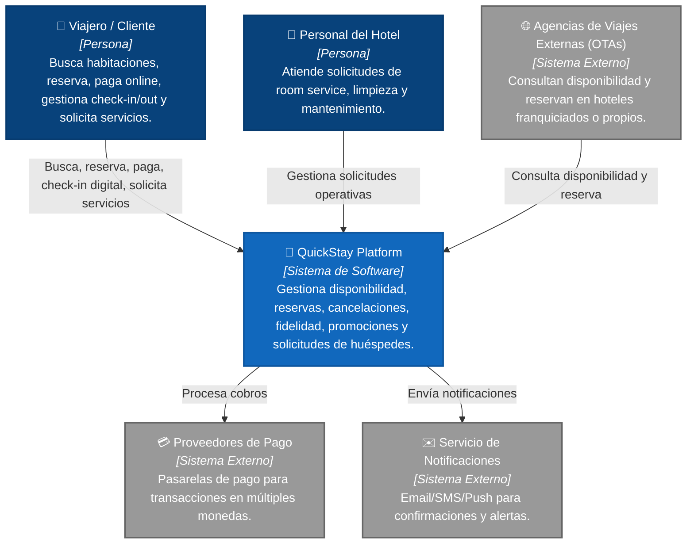
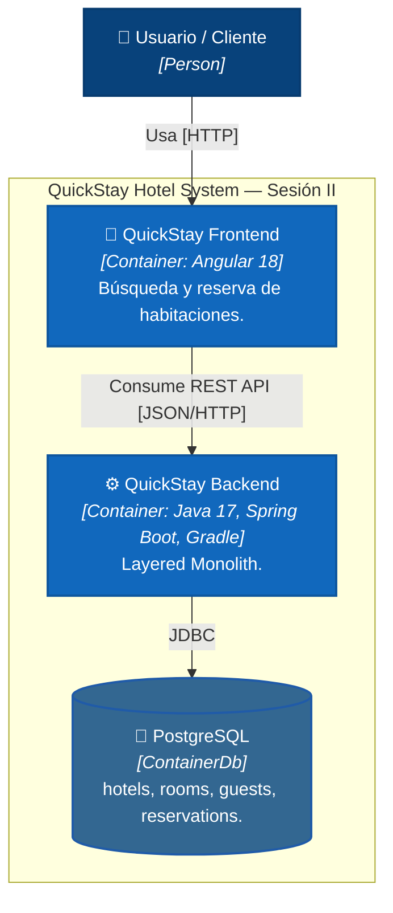
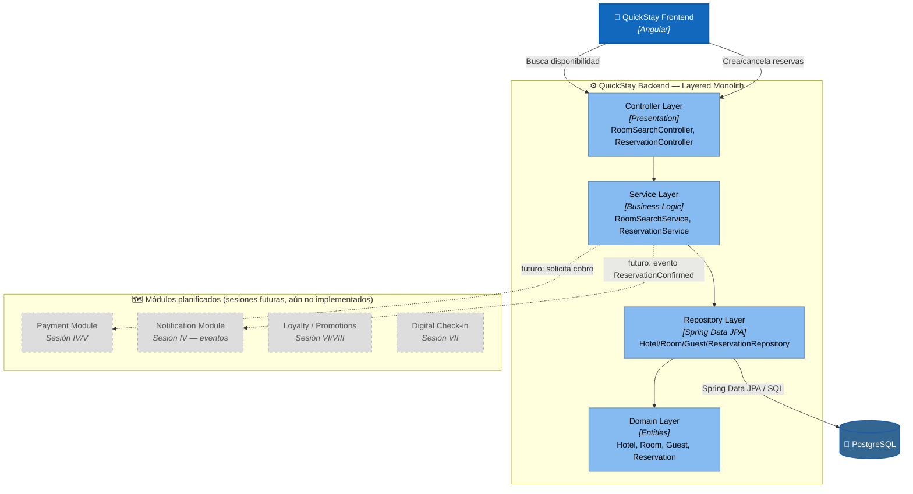

# QuickStay Hotel Platform

## 🎯 Objetivo de la kata
Desarrollar una plataforma de reservas hoteleras que permita buscar disponibilidad,
reservar, pagar, gestionar check-in/out digital y recibir promociones — evolucionando
progresivamente su arquitectura a lo largo de las 8 sesiones del módulo
*Microservices, Event-Driven and Cloud-Native*.

---

# 1era Actividad — Choose a Software Architecture Kata
**QuickStay Hotel Platform**

## Description
A hotel group wants to create a booking platform for its hotels. Customers can search
availability, reserve rooms, pay online, check in digitally, request services, and
receive promotions.

## Users
Potentially millions of travelers across regions.

## Requirements
- Allow users to search rooms by location, date, price, and amenities.
- Allow users to reserve a room.
- Allow users to pay online or at the hotel.
- Allow users to cancel or modify reservations.
- Support loyalty points.
- Support national promotions.
- Support hotel-specific promotions.
- Allow digital check-in and check-out.
- Allow users to request room service, housekeeping, or maintenance.
- Notify customers about booking confirmation, reminders, and changes.
- Integrate with external travel agencies.
- Integrate with payment providers.
- Support mobile access.

## Additional Context
- Some hotels are owned by the company; others are franchises.
- Room availability changes constantly.
- Third-party booking platforms may reserve rooms too.
- Overbooking must be avoided or carefully managed.
- Cancellations may have different policies.
- Future expansion includes multiple countries and currencies.

---

# 2da Actividad — Build the Monolith Core

## 🏛️ Arquitectura actual (Sesión II): Layered Monolith

> **Importante:** en esta sesión el proyecto es un **monolito en capas** puro
> (separado por rol técnico: presentation → service → repository → domain),
> **no** un monolito modular. La separación por dominio de negocio
> (`booking`, `payment`, `user`, `notification`, `search` como paquetes aislados)
> es justamente el refactor que corresponde a la **Sesión III** (Structural
> Variation Styles → Bounded Contexts), por lo que todavía no está implementado.

```
quickstay-hotel-platform/
├── backend/                          Spring Boot (Java 17, Gradle Groovy)
│   └── src/main/java/com/quickstay/
│       ├── controller/     RoomSearchController, ReservationController
│       ├── service/        RoomSearchService, ReservationService
│       ├── repository/     HotelRepository, RoomRepository,
│       │                   GuestRepository, ReservationRepository
│       ├── domain/         Hotel, Room, Guest, Reservation (+ enums)
│       ├── dto/             Request/Response records
│       └── exception/       GlobalExceptionHandler, RoomNotAvailableException
│
├── frontend/quickstay-web/           Angular 18 (standalone components)
│   └── src/app/
│       ├── core/
│       │   ├── models/       room.model.ts
│       │   └── services/     RoomSearchService, ReservationService
│       └── features/
│           └── room-search/  Búsqueda + reserva (componente único)
│
├── infra/
│   └── docker-compose.yml    PostgreSQL 16
```

### Alcance funcional implementado (MVP Sesión II)
- ✅ Búsqueda de disponibilidad por ciudad, fechas y precio máximo
- ✅ Reserva de habitación con validación de solapamiento (anti-overbooking
  básico, dentro de una única transacción)
- ✅ Cancelación de reserva
- ✅ Alta automática de huésped al reservar
- ⏳ Pago online, loyalty, promociones, check-in digital, notificaciones,
  integración con OTAs → planificado para sesiones posteriores (ver roadmap
  más abajo)

### Principios de esta sesión
- **Un solo deployable**: todo el backend corre en un único proceso Spring Boot.
- **Comunicación entre capas por invocación directa** (no eventos ni mensajería
  todavía — eso es Sesión IV).
- **Base de datos única y compartida**, transacciones ACID simples (`@Transactional`).
- **API First**: el backend expone JSON vía REST; el frontend Angular lo
  consume con `HttpClient`.

---

## 📦 Tecnologías

| Capa | Tecnología |
|------|------------|
| **Backend** | Java 17, Spring Boot 3.3.2, Gradle 8.8 (Groovy DSL), Spring Data JPA, Flyway, Lombok, PostgreSQL driver |
| **Frontend** | Angular 18 (standalone components), TypeScript, SCSS |
| **Base de datos** | PostgreSQL 16 (Docker) |
| **Gestión de dependencias** | Gradle (backend) & npm (frontend) |
| **Control de versiones** | Git — rama + tag por sesión |

---

# 🏨 Arquitectura de Software (C4 Model)

## 📌 Nivel 1: Diagrama de Contexto



> Los sistemas externos (OTAs, pagos, notificaciones) representan el estado
> **objetivo** de QuickStay. En Sesión II todavía no hay integraciones reales
> con ellos — se agregan en sesiones posteriores (IV en adelante).

## 📦 Nivel 2: Diagrama de Contenedores



## 🧩 Nivel 3: Diagrama de Componentes — estado real vs roadmap



---

## 🚀 Cómo levantar el entorno local

### 1. Base de datos (PostgreSQL vía Docker)

> Nota: si ya tenés un PostgreSQL nativo corriendo en tu máquina (Windows/Mac),
> puede ocupar el puerto 5432. Este proyecto usa el puerto **5433** en el host
> para evitar ese conflicto (ver `infra/docker-compose.yml`).

```bash
cd infra
docker compose up -d
docker ps   # confirmar que "quickstay-postgres" está Up
```

Credenciales (definidas en `docker-compose.yml`): DB `quickstay`, user/pass
`quickstay`/`quickstay`.

### 2. Backend

```bash
cd backend
./gradlew bootRun        # Windows: .\gradlew.bat bootRun
```

Al arrancar, Flyway crea el schema y carga datos demo automáticamente
(`V1__init_schema.sql`, `V2__seed_demo_data.sql`). La API queda en
`http://localhost:8080`.

**Nota:** el proceso queda corriendo en foreground (no "termina" — la barra de
progreso de Gradle se queda fija, eso es normal). Confirmá que levantó bien
buscando en el log: `Started QuickstayApplication in X seconds`.

Endpoints disponibles:
```
GET  /api/rooms/search?city={city}&checkIn={yyyy-MM-dd}&checkOut={yyyy-MM-dd}&maxPrice={decimal}
POST /api/reservations
POST /api/reservations/{id}/cancel
```

Ejemplo:
```
http://localhost:8080/api/rooms/search?city=La%20Paz&checkIn=2026-09-01&checkOut=2026-09-05&maxPrice=600
```

### 3. Frontend

```bash
cd frontend/quickstay-web
npm install
npm start
```

Se levanta en `http://localhost:4200`, ya conectado al backend
(`src/environments/environment.ts`).

### 4. Verificar

- `http://localhost:4200` → formulario de búsqueda y listado de habitaciones
  disponibles, con opción de reservar.
- `http://localhost:8080/api/rooms/search?...` → JSON con habitaciones (ver
  ejemplo arriba).

---

## 🧪 Troubleshooting rápido

| Síntoma | Causa probable | Solución |
|---|---|---|
| `FATAL: la autentificación password falló` | Volumen de Postgres viejo con otras credenciales, o conflicto de puerto con un Postgres nativo | `docker compose down -v && docker compose up -d` |
| `Unable to determine Dialect without JDBC metadata` | Backend no logra conectar a la DB (mensaje real de Hibernate queda oculto) | Verificar `docker ps` y el puerto en `application.yml` |
| Barra de Gradle se queda en 80-90% | Comportamiento normal de `bootRun` — el proceso queda vivo sirviendo peticiones | Buscar `Started QuickstayApplication` en el log |

---

## 🗂️ Git — flujo por sesión

```bash
git checkout -b session-02-layered-monolith
git add .
git commit -m "feat: session 02 layered monolith core"
git push -u origin session-02-layered-monolith

git checkout main
git merge --no-ff session-02-layered-monolith -m "merge: session 02 layered monolith core"
git tag -a v0.2-layered-monolith -m "Session II: Layered Monolith Core"
git push origin main --tags
```

---
