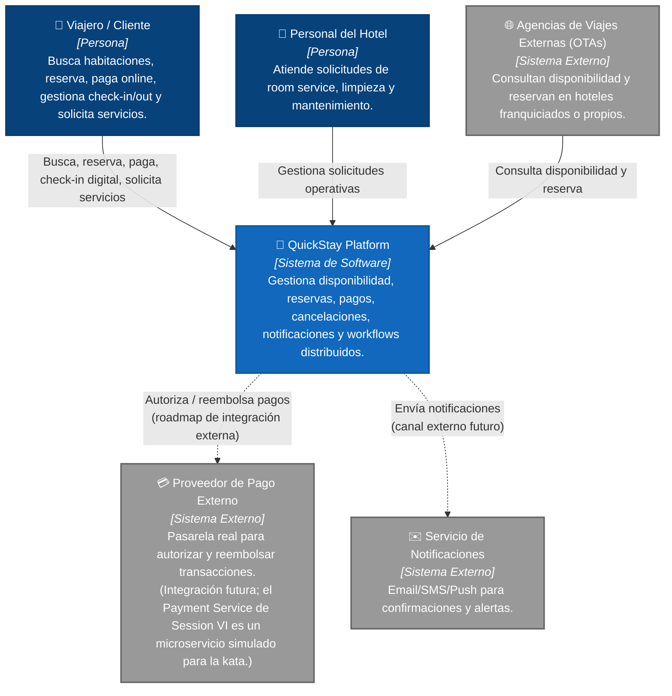
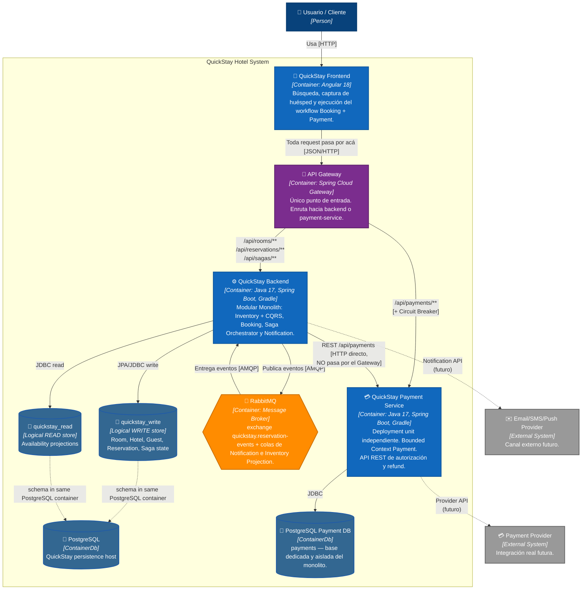
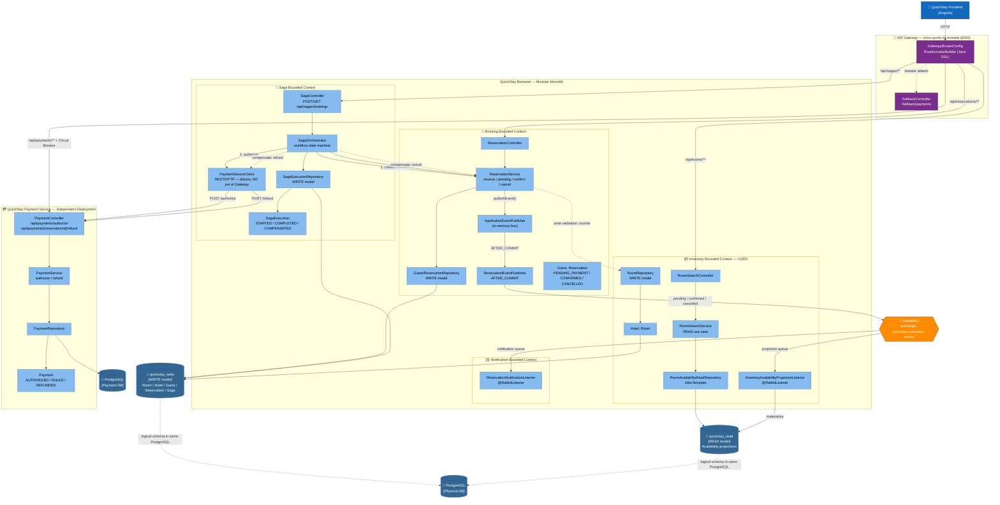

# QuickStay Hotel Platform

## 🎯 Objetivo de la kata
Desarrollar una plataforma de reservas hoteleras que permita buscar disponibilidad,
reservar, pagar, gestionar check-in/out digital y recibir promociones — evolucionando
progresivamente su arquitectura a lo largo de las 8 sesiones del módulo
*Microservices, Event-Driven and Cloud-Native*.

---

# 1era Actividad — Choose a Software Architecture Kata
**QuickStay Hotel Platform**

## Description
A hotel group wants to create a booking platform for its hotels. Customers can search
availability, reserve rooms, pay online, check in digitally, request services, and
receive promotions.

## Users
Potentially millions of travelers across regions.

## Requirements
- Allow users to search rooms by location, date, price, and amenities.
- Allow users to reserve a room.
- Allow users to pay online or at the hotel.
- Allow users to cancel or modify reservations.
- Support loyalty points.
- Support national promotions.
- Support hotel-specific promotions.
- Allow digital check-in and check-out.
- Allow users to request room service, housekeeping, or maintenance.
- Notify customers about booking confirmation, reminders, and changes.
- Integrate with external travel agencies.
- Integrate with payment providers.
- Support mobile access.

## Additional Context
- Some hotels are owned by the company; others are franchises.
- Room availability changes constantly.
- Third-party booking platforms may reserve rooms too.
- Overbooking must be avoided or carefully managed.
- Cancellations may have different policies.
- Future expansion includes multiple countries and currencies.

---

# 2da Actividad — Build the Monolith Core (Sesión II)

Se construyó un **monolito en capas** puro (separado por rol técnico:
presentation → service → repository → domain), sin separación por dominio
de negocio todavía. Ese fue el punto de partida intencional — ver el
refactor hacia dominios en la Sesión III, más abajo.

### Alcance funcional (sigue vigente)
- ✅ Búsqueda de disponibilidad por ciudad, fechas y precio máximo
- ✅ Reserva de habitación con validación de solapamiento (anti-overbooking
  básico, dentro de una única transacción)
- ✅ Cancelación de reserva
- ✅ Alta automática de huésped al reservar
- ⏳ Pago online, loyalty, promociones, check-in digital, notificaciones,
  integración con OTAs → planificado para sesiones posteriores

---

# 3ra Actividad — Structural Variation Styles (Sesión III)

**Actividades:** *Conduct an architectural review of the initial monolith*
+ *Refactor the code into strict domain packages/namespaces*.

Ver el detalle completo de la revisión y las decisiones de diseño en
[`docs/session-03-evaluation.md`](docs/session-03-evaluation.md).

## 🏛️ Arquitectura actual: Modular Monolith (Bounded Contexts)

El código se reorganizó de capas técnicas a **paquetes por dominio de
negocio**. Sigue siendo un único deployable con una única base de datos
(todavía no es microservicios), pero cada dominio ya es internamente
cohesivo y sus límites están explícitos en el código.

```
quickstay-hotel-platform/
├── backend/                          Spring Boot (Java 17, Gradle Groovy)
│   └── src/main/java/com/quickstay/
│       ├── inventory/                Bounded Context: Hoteles y habitaciones
│       │   ├── domain/       Hotel, Room, HotelOwnershipType
│       │   ├── repository/   HotelRepository, RoomRepository
│       │   ├── service/      RoomSearchService
│       │   ├── web/          RoomSearchController
│       │   └── dto/          RoomSearchRequest, RoomAvailabilityResponse
│       │
│       ├── booking/                  Bounded Context: Huéspedes y reservas
│       │   ├── domain/       Guest, Reservation, ReservationStatus
│       │   ├── repository/   GuestRepository, ReservationRepository
│       │   ├── service/      ReservationService
│       │   ├── web/          ReservationController
│       │   ├── dto/          ReservationRequest, ReservationResponse
│       │   └── exception/    RoomNotAvailableException
│       │
│       └── shared/                   Cross-cutting
│           └── exception/    GlobalExceptionHandler
│
├── frontend/quickstay-web/           Angular 18 (standalone components) — sin cambios
├── infra/                            docker-compose (PostgreSQL) — sin cambios
└── docs/    
    └── session-03-evaluation.md      Revisión arquitectónica + justificación del refactor
```

### Cambio de diseño clave
`Reservation` ya **no** mapea `Room` como relación JPA (`@ManyToOne`) —
ahora guarda solo `roomId: UUID`. Esto evita que el dominio Booking cargue
por accidente el grafo de entidades de Inventory, preservando el límite del
Bounded Context aunque ambas tablas sigan en la misma base de datos física.
Detalle completo en `docs/session-03-evaluation.md`.

### Principios de esta sesión
- **Bounded Contexts explícitos en el código**, no solo en la cabeza del
  equipo.
- **Un solo deployable y una sola base de datos** — la modularización es de
  código, todavía no de infraestructura (eso empieza en Sesión VI).
- Acoplamiento cross-dominio que queda **documentado como decisión
  consciente**, no eliminado del todo (se resuelve con eventos en Sesión IV
  y CQRS en Sesión VIII).

---

# 4ta Actividad — Enterprise Integration & Messaging (Sesión IV)

**Actividades:** *Map Out Domain Events* + *Wire an In-Memory Event Bus* +
*Refactor the event bus to use an external message broker (RabbitMQ)*.

Ver el detalle completo en:
- [`docs/session-04-domain-events.md`](docs/session-04-domain-events.md) — catálogo de eventos
- [`docs/session-04-evaluation.md`](docs/session-04-evaluation.md) — evaluación arquitectónica

## 🔀 De llamada síncrona a mensajería asíncrona

Nace el Bounded Context **Notification**. Booking ya no lo conocería aunque
quisiera: se comunican exclusivamente a través de RabbitMQ.

```
booking/
├── event/                 Domain events internos (in-memory)
│   ├── ReservationConfirmedEvent
│   └── ReservationCancelledEvent
└── messaging/              Infraestructura: traduce domain event → mensaje externo
    ├── ReservationIntegrationEvent   (contrato de mensaje, wire format)
    ├── BookingMessagingConfig        (declara el exchange RabbitMQ)
    └── ReservationEventPublisher     (@TransactionalEventListener AFTER_COMMIT)

notification/
└── messaging/
    ├── ReservationEventMessage       (copia propia del contrato — sin importar booking)
    ├── NotificationMessagingConfig   (declara su propia cola + binding)
    └── ReservationNotificationListener (@RabbitListener — logea la "notificación")

shared/
└── messaging/
    └── RabbitMqConfig                (converter JSON compartido)
```

### Flujo
1. `ReservationService.reserve()` guarda la reserva y publica
   `ReservationConfirmedEvent` en memoria (bus de Spring).
2. `ReservationEventPublisher` escucha ese evento, pero solo actúa
   **después de que la transacción confirma** (`AFTER_COMMIT`) — si la
   reserva falla, nunca sale ningún mensaje.
3. El mensaje llega a RabbitMQ, al exchange `quickstay.reservation-events`.
4. `ReservationNotificationListener` (dominio Notification, sin ningún
   import de `booking`) lo consume de su propia cola y "envía" la
   notificación (por ahora, solo logging — el canal real de email/SMS
   queda fuera de alcance de este módulo).

### Por qué el cliente HTTP no espera la notificación
La reserva se confirma y responde `201 Created` de inmediato. La
notificación llega con **consistencia eventual** — normalmente milisegundos
después, pero desacoplada del tiempo de respuesta de la API. Detalle
completo del trade-off en `docs/session-04-evaluation.md`.

---

## 📦 Tecnologías

| Capa | Tecnología |
|------|------------|
| **Backend** | Java 17, Spring Boot 3.3.2, Gradle 8.8 (Groovy DSL), Spring Data JPA/JDBC, Spring AMQP, Flyway, Lombok, PostgreSQL driver |
| **Payment Service** | Java 17, Spring Boot 3.3.2, Gradle 8.8, Spring Data JPA, Flyway, PostgreSQL driver |
| **Mensajería** | RabbitMQ 3 (management UI incluida) |
| **Frontend** | Angular 18 (standalone components), TypeScript, SCSS |
| **Base de datos** | PostgreSQL 16 (Docker): QuickStay DB + Payment DB aislada |
| **Gestión de dependencias** | Gradle (backend) & npm (frontend) |
| **Control de versiones** | Git — rama + tag por sesión |

---

# 🏨 Arquitectura de Software (C4 Model)

## 📌 Nivel 1: Diagrama de Contexto



> **Estado a Sesión VIII:** QuickStay mantiene los bounded contexts/módulos
> `Inventory`, `Booking`, `Payment`, `Saga` y `Notification`. Payment ya es un
> microservicio independiente, el API Gateway es el único punto de entrada
> público y Inventory separa el modelo de lectura del modelo de escritura
> mediante CQRS. El proveedor de pago externo y el canal real de
> email/SMS/Push continúan como integraciones futuras.

## 📦 Nivel 2: Diagrama de Contenedores (Sesión VIII)



> **Evolución de Sesión VI → VII → VIII:** el frontend deja de hablarle
> directo al backend (`8080`). Ahora todo pasa por el **API Gateway**
> (`8000`), que decide según el path si la request va al monolito o al
> microservicio de Payment. La llamada interna `Saga → Payment` (línea
> punteada "NO pasa por el Gateway" en el diagrama) sigue siendo directa —
> el Gateway resuelve tráfico norte-sur (cliente → sistema), no este-oeste
> (servicio → servicio). Desde Sesión VIII, además, `QuickStay Backend` ya
> no tiene una única fuente de datos homogénea: separa **write model**
> (`quickstay_write`) de **read model** (`quickstay_read`) para las
> consultas de disponibilidad — ambos siguen siendo schemas lógicos dentro
> del mismo container PostgreSQL, no bases físicamente distintas. Ver
> `docs/session-07-evaluation.md` y la sección CQRS más abajo.

### Cambios de la Sesión VI en el Nivel 2

- Se extrae físicamente el **Payment Bounded Context** a `payment-service/`.
- `QuickStay Backend` conserva `Booking`, `Inventory`, `Saga` y `Notification`.
- `Payment Service` tiene despliegue, puerto (`8081`) y ciclo de vida propios.
- Se crea una **base PostgreSQL dedicada** `quickstay_payment` en el puerto `5434`.
- La tabla `payments` deja de existir en la base del monolito mediante
  `V4__extract_payment_context.sql`.
- La comunicación `Saga → Payment` pasa a ser **REST/HTTP**.
- La compensación `refund` sigue siendo parte del workflow Saga.

### Cambios de la Sesión VII en el Nivel 2

- Nace **`api-gateway/`** (Spring Cloud Gateway), único punto de entrada
  público en el puerto `8000`.
- El **frontend** ahora apunta a `http://localhost:8000` en vez de
  `http://localhost:8080` (`environment.ts`).
- Rutas hacia el monolito (`/api/rooms/**`, `/api/reservations/**`,
  `/api/sagas/**`): sin Circuit Breaker — si el monolito cae, cae todo el
  sistema de todas formas.
- Ruta hacia Payment (`/api/payments/**`): **con Circuit Breaker**
  (Resilience4j) — Payment es el componente aislado con mayor probabilidad
  de fallar de forma independiente.
- CORS se centraliza en el Gateway (`spring.cloud.gateway.globalcors`); no se
  duplica el header `Access-Control-Allow-Origin` en el backend.

### Cambios de la Sesión VIII en el Nivel 2

- Inventory adopta **CQRS explícito** dentro del mismo deployable `quickstay-backend`.
- PostgreSQL contiene dos **schemas lógicos independientes**: `quickstay_write` y
  `quickstay_read`.
- El WRITE model contiene el estado transaccional de dominio; el READ model contiene
  proyecciones denormalizadas para disponibilidad.
- RabbitMQ distribuye los eventos de Booking hacia la proyección de Inventory.
- La búsqueda usa exclusivamente `RoomAvailabilityReadRepository` + `JdbcTemplate`
  sobre `quickstay_read`; no consulta repositorios JPA del WRITE model.
- La separación física de servidor/base queda como evolución futura si la carga lo
  justifica; la separación de modelos ya es explícita y verificable en PostgreSQL.

## 🧩 Nivel 3: Diagrama de Componentes — Bounded Contexts + Messaging + Saga + CQRS + Extracted Payment + API Gateway



> **CQRS (Sesión VIII):** Inventory ya no resuelve la disponibilidad leyendo el
> modelo JPA de `Room` y cruzándolo con `Reservation`. El caso de uso de búsqueda
> usa exclusivamente el read model denormalizado. El write model sigue siendo la
> autoridad para validar y persistir reservas.
>
> **Proyección asíncrona:** Booking publica `RESERVATION_PENDING_PAYMENT`,
> `RESERVATION_CONFIRMED` y `RESERVATION_CANCELLED` después del commit. La cola
> `inventory.room-availability-projection` actualiza las tablas de lectura.
> Notification solo recibe confirmaciones y cancelaciones, no el evento temporal
> de pago pendiente.
>
> **Escalabilidad:** la separación lógica permite evolucionar el read side hacia
> réplicas o una base especializada si el perfil de consultas lo exige, sin
> convertir todavía esa complejidad en infraestructura obligatoria.
>
> **Bounded Context:** Payment continúa sin compartir entidades, repositorios ni
> tablas con Booking. Inventory y Booking siguen dentro del mismo deployable, pero
> la lectura de disponibilidad queda desacoplada mediante el modelo de consulta.

# 🚪 Session VII — Advanced Distributed Architectures: API Gateway

## 🎯 Actividad implementada

*Deploy an API Gateway to act as the single entry point for clients,
routing incoming requests seamlessly to either the new microservice or the
remaining monolith.*

Nace **`api-gateway/`** — un tercer deployable (Spring Cloud Gateway,
puerto `8000`), que se convierte en el único punto de entrada público del
sistema. El frontend deja de hablarle directo al backend.

## 🗺️ Rutas configuradas

| Path | Destino | Circuit Breaker |
|---|---|---|
| `/api/rooms/**` | `quickstay-backend` | No |
| `/api/reservations/**` | `quickstay-backend` | No |
| `/api/sagas/**` | `quickstay-backend` | No |
| `/api/payments/**` | `quickstay-payment-service` | **Sí** (Resilience4j) |

Configuración de rutas en `api-gateway/src/main/java/com/quickstay/gateway/config/GatewayRoutesConfig.java`
(DSL Java de Spring Cloud Gateway, vía `RouteLocatorBuilder`) — se prefirió
código sobre YAML para que el compilador valide la sintaxis de cada ruta y
filtro, en vez de descubrir un typo recién en tiempo de ejecución. El
`application.yml` del Gateway solo tiene configuración (CORS, puertos,
umbrales del Circuit Breaker), no las rutas en sí.

## 🔌 Circuit Breaker sobre Payment

Si `payment-service` está caído, lento, o falla por encima del umbral
configurado (`failure-rate-threshold: 50` sobre una ventana de 10 llamadas),
el Gateway deja de reenviarle tráfico y responde inmediatamente con `503`
vía `FallbackController`, en vez de dejar al cliente esperando un timeout.

Estado del breaker en vivo: `http://localhost:8000/actuator/circuitbreakers`.

Detalle completo de la relación entre este Circuit Breaker y la
compensación del Saga (son mecanismos de resiliencia distintos, en capas
distintas) en `docs/session-07-evaluation.md`.

## 🧠 Decisiones de diseño de la Session VII

### ¿Por qué el Saga sigue llamando a Payment directo, sin pasar por el Gateway?

El API Gateway resuelve tráfico **norte-sur** (cliente externo → sistema).
La llamada `SagaOrchestrator → PaymentServiceClient` es **este-oeste**
(servicio → servicio, interna al sistema) — pasarla por el Gateway no
aportaría nada y agregaría un salto de red innecesario. Ver
`docs/session-07-evaluation.md` para el detalle completo.

### ¿Por qué Circuit Breaker solo en la ruta de Payment?

Las rutas hacia el monolito no lo necesitan tanto: si el monolito cae, cae
todo el sistema igual (Inventory, Booking y Saga viven ahí). Payment, en
cambio, es un fallo aislado real — el sistema puede seguir funcionando
parcialmente (buscar habitaciones, por ejemplo) aunque Payment esté caído.

### Trade-off

**Ganancia:** el frontend (y cualquier cliente futuro — app mobile, un
partner externo) tiene un único endpoint estable, sin importar cuántos
servicios haya detrás ni cómo cambien sus URLs internas. Resiliencia
explícita ante la caída del componente más nuevo del sistema.

**Costo:** un deployable más para operar, un salto de red adicional en cada
request del cliente, y un nuevo punto único de falla (si el Gateway cae,
cae el acceso a todo el sistema) — que en un entorno productivo se mitiga
corriendo múltiples réplicas del Gateway detrás de un load balancer, fuera
del alcance de este módulo.

# ☁️ Session VIII — Cloud-Native Operations & Selection: CQRS

## 🎯 Actividad implementada

*Split Read & Write Models (CQRS).*

La búsqueda de disponibilidad pasa a utilizar un **read model** denormalizado,
separado del modelo JPA de escritura. El read model se actualiza de forma
asíncrona desde eventos de Booking mediante RabbitMQ.

### 🧩 Separación implementada

```text
                         QUICKSTAY POSTGRESQL
                ┌─────────────────────────────────┐
COMMANDS        │  quickstay_write                │
──────────────► │  Room / Hotel / Reservation     │
                │  Guest / Saga state              │
                └──────────────┬──────────────────┘
                               │
                         Domain Event
                               │
                               ▼
                         🐰 RabbitMQ
                               │
                         Projection
                               │
                               ▼
                ┌─────────────────────────────────┐
QUERIES         │  quickstay_read                 │
──────────────► │  Availability projections       │
                └─────────────────────────────────┘

POST /api/sagas/bookings → WRITE
GET  /api/rooms/search   → READ
```

### 📨 Eventos de proyección

| Evento | Routing key | Inventory | Notification |
|---|---|---|---|
| `RESERVATION_PENDING_PAYMENT` | `reservation.pending-payment` | Actualiza disponibilidad | No |
| `RESERVATION_CONFIRMED` | `reservation.confirmed` | Actualiza disponibilidad | Sí |
| `RESERVATION_CANCELLED` | `reservation.cancelled` | Libera disponibilidad | Sí |

El evento `PENDING_PAYMENT` es necesario porque el Saga bloquea la habitación
mientras procesa el pago. Así, el read model no muestra una habitación como
disponible durante ese intervalo.

## 📈 Selección arquitectónica según carga

QuickStay tiene un perfil donde las búsquedas de disponibilidad pueden ser muy
superiores a las escrituras. CQRS permite optimizar ese camino sin convertir
todo el sistema en microservicios.

- **Lectura:** modelo denormalizado, índices orientados a ciudad/precio y fechas.
- **Escritura:** modelo normalizado y transaccional, autoridad anti-overbooking.
- **Actualización:** asíncrona mediante RabbitMQ.
- **Consistencia:** eventual en la lectura; transaccional en la escritura crítica.

### Trade-off

**Ganancia:** lecturas más simples, menor acoplamiento cross-domain y una ruta
clara hacia escalado independiente del read side.

**Costo:** dos modelos que mantener, propagación asíncrona y necesidad futura de
observabilidad/rebuild de proyecciones.

No se agregó una segunda base física ni autoscaling real: hacerlo ahora
aumentaría la complejidad operativa sin estar justificado por el alcance de la
actividad.

## 🧪 Evidencia de la actividad

1. RabbitMQ debe mostrar la cola `inventory.room-availability-projection` con
   consumidor activo.
2. Una reserva confirmada genera el evento `RESERVATION_CONFIRMED`.
3. Inventory registra en logs `[CQRS] Read model actualizado`.
4. Una nueva búsqueda para las mismas fechas deja de mostrar la habitación
   después de que la proyección procese el evento.
5. Una compensación del Saga genera `PENDING_PAYMENT → CANCELLED` en el read
   model y vuelve a liberar la habitación.

Detalle completo en [`docs/session-08-evaluation.md`](docs/session-08-evaluation.md).

## 🎬 Demo de Session VIII — CQRS y resiliencia

### 1. Verificar el split Read/Write

En PostgreSQL se deben observar los schemas:

```sql
SELECT schema_name
FROM information_schema.schemata
WHERE schema_name IN ('quickstay_write', 'quickstay_read');
```

Y las tablas:

```sql
SELECT table_schema, table_name
FROM information_schema.tables
WHERE table_schema IN ('quickstay_write', 'quickstay_read')
ORDER BY table_schema, table_name;
```

Debe verse el estado transaccional en `quickstay_write` y las proyecciones en
`quickstay_read`.

### 2. Demostrar CQRS con una reserva

1. Buscar una habitación desde el frontend.
2. Crear una reserva.
3. Mostrar el evento en RabbitMQ.
4. Mostrar que `inventory.room-availability-projection` consume el evento.
5. Repetir la búsqueda y comprobar que el READ model refleja la reserva después
   de procesar la proyección.

### 3. Demostrar consistencia eventual

Detener únicamente RabbitMQ:

```bash
docker compose stop rabbitmq
```

El WRITE side y el READ side dejan de recibir sincronización por eventos mientras
el broker está caído. La búsqueda puede mostrar temporalmente un estado anterior
del READ model.

Recuperar:

```bash
docker compose start rabbitmq
```

Verificar conexiones, colas y consumidores en `http://localhost:15672` y revisar:

```bash
docker compose logs -f backend
```

> Una cola durable puede conservar mensajes que ya fueron aceptados por RabbitMQ.
> CQRS por sí solo no garantiza recuperar un evento que nunca llegó al broker;
> para esa garantía se necesitaría un Transactional Outbox.

### 4. Demostrar resiliencia del Payment Service

Detener solamente Payment:

```bash
docker compose stop payment-service
```

Intentar una reserva/pago y observar el comportamiento del Saga y del Circuit
Breaker del Gateway. Recuperar:

```bash
docker compose start payment-service
```

## 🧠 Decisiones de diseño de la Session VIII

### ¿Por qué CQRS y no otra extracción de microservicio?

Porque el objetivo de esta sesión es separar responsabilidades de lectura y
escritura según el perfil de carga. Extraer Inventory completo sería un cambio
de deployment adicional y no es necesario para demostrar el patrón.

### ¿Por qué mantener una sola PostgreSQL?

El read model y el write model son lógicamente distintos, pero compartir la
infraestructura persistente mantiene bajo el coste operativo. Una base de lectura
independiente queda como evolución futura si el volumen lo justifica.

### ¿CQRS elimina el anti-overbooking?

No. La reserva continúa validándose contra el write model. El read model es una
herramienta de consulta, no la autoridad para confirmar una reserva.

---

# 📱 Cliente Móvil (Flutter) — Demo completa con API Gateway

No es una actividad formal del programa académico — se agregó para cubrir el
requerimiento de la kata *"Support mobile access"* y, sobre todo, para hacer
una demo completa donde el **API Gateway** (Sesión VII) atienda a un cliente
real distinto del navegador.

Vive en `mobile/`. Es un proyecto Flutter con 4 pantallas: búsqueda de
habitaciones, reserva + pago (dispara el Saga de Sesión V), resultado
(confirmado o compensado), y consulta de estado de un Saga por ID.

**Setup e instrucciones completas en [`mobile/README.md`](mobile/README.md)**
— incluye por qué el paquete no trae `android/`/`ios/` generados (se crean
con `flutter create` para evitar problemas de versión), los dos ajustes
nativos necesarios para permitir tráfico HTTP sin TLS, cómo configurar la
URL del Gateway según emulador/simulador/celular físico, y un guion de demo
paso a paso (incluyendo cómo forzar la compensación del Saga y cómo probar
el Circuit Breaker de la ruta de Payment).

### Por qué es un buen cierre de demo

- Ejercita el **mismo backend** que el frontend Angular, pero sin pasar por
  CORS (CORS es una restricción de navegador — un cliente HTTP nativo como
  el de Flutter no está sujeto a ella). Buen contraste para explicar en la
  presentación.
- El toggle "Simular fallo de pago" en la pantalla de reserva dispara la
  compensación del Saga en vivo — mismo mecanismo de Sesión V, ahora
  visible desde un cliente mobile.
- El botón de consulta de estado de Saga ejercita `GET /api/sagas/bookings/{id}`
  independientemente del flujo de reserva, útil para mostrar que el estado
  persiste server-side (tabla `saga_executions`) más allá de la sesión HTTP
  que lo originó.

# 📚 Documentación por sesión

| Sesión | Arquitectura / foco | Documentación |
|---|---|---|
| III | Modular Monolith + Bounded Contexts | `docs/session-03-evaluation.md` |
| IV | Enterprise Integration & Messaging | `docs/session-04-domain-events.md` · `docs/session-04-evaluation.md` |
| V | Service-Based & Orchestrated Styles — Saga | `docs/session-05-saga-evaluation.md` |
| VI | Microservices Deep Dive — Payment extraction + Data Isolation | `docs/session-06-microservices-extraction.md` |
| VII | Advanced Distributed Architectures — API Gateway + Circuit Breaker | `docs/session-07-evaluation.md` |
| VIII | Cloud-Native Operations & Selection — CQRS | `docs/session-08-evaluation.md` |
| — | Cliente Móvil Flutter (bonus, kata "Support mobile access") | `mobile/README.md` |

## 🚀 Cómo levantar el entorno local

### 1. Infraestructura (PostgreSQL + RabbitMQ vía Docker)

> Nota: si ya tenés un PostgreSQL nativo corriendo en tu máquina (Windows/Mac),
> puede ocupar el puerto 5432. Este proyecto usa los puertos **5433** y **5434**
> en el host para las dos bases PostgreSQL aisladas (ver `infra/docker-compose.yml`).

> **Importante para Session VIII:** como la separación CQRS cambia el esquema de
> persistencia, si ya tenías la base de una Session anterior en el volumen Docker,
> para una ejecución limpia de esta versión usa una vez:
>
> ```bash
> docker compose down -v
> docker compose up -d
> ```
>
> Después de esa inicialización, para cambios normales de código no necesitas borrar
> los volúmenes. Puedes reconstruir solo el servicio afectado con
> `docker compose up -d --build backend`.
>
```bash
cd infra
docker compose up -d
docker ps   # confirmar quickstay-postgres, quickstay-payment-postgres, pgadmin y quickstay-rabbitmq
```

Credenciales:
- PostgreSQL QuickStay: DB `quickstay`, user/pass `quickstay`/`quickstay` (puerto 5433)
- PostgreSQL Payment: DB `quickstay_payment`, user/pass `quickstay_payment`/`quickstay_payment` (puerto 5434)
- RabbitMQ: user/pass `quickstay`/`quickstay` (puerto 5672 AMQP, 15672 management UI)

Management UI de RabbitMQ: `http://localhost:15672` — útil para ver el
exchange `quickstay.reservation-events` y la cola
`notification.reservation-events` y `inventory.room-availability-projection` en tiempo real.

### 2. Backend (monolito)

```bash
cd backend
./gradlew bootRun        # Windows: .\gradlew.bat bootRun
```

Al arrancar, Flyway crea `quickstay_write`, `quickstay_read` y carga los datos demo automáticamente.
`quickstay_write` contiene el WRITE model y `quickstay_read` contiene las proyecciones CQRS. En ejecución local con `bootRun`, la API queda en `http://localhost:8080`.
Cuando se ejecuta mediante Docker Compose, queda expuesta en `http://localhost:8082`.

**Nota:** el proceso queda corriendo en foreground (no "termina" — la barra de
progreso de Gradle se queda fija, eso es normal). Confirmá que levantó bien
buscando en el log: `Started QuickstayApplication in X seconds`.

Endpoints disponibles:
```
GET  /api/rooms/search?city={city}&checkIn={yyyy-MM-dd}&checkOut={yyyy-MM-dd}&maxPrice={decimal}
POST /api/reservations
POST /api/reservations/{id}/cancel
POST /api/sagas/bookings
GET  /api/sagas/bookings/{sagaId}
```

### 3. Payment Service (microservicio)

En otra terminal:

```bash
cd payment-service
./gradlew bootRun        # Windows: .\gradlew.bat bootRun
```

Queda disponible en `http://localhost:8081`. El backend lo llama
directamente vía `PAYMENT_SERVICE_URL` (default `http://127.0.0.1:8081`) —
no hace falta configurar nada extra si corrés todo en `localhost`.

### 4. API Gateway (Sesión VII — punto de entrada único)

En otra terminal:

```bash
cd api-gateway
./gradlew bootRun        # Windows: .\gradlew.bat bootRun
```

Queda disponible en `http://localhost:8000`. A partir de esta sesión, es el
**único** endpoint que el frontend (y cualquier cliente externo) debería
usar — enruta automáticamente hacia `backend` o `payment-service` según el
path (ver `docs/session-07-evaluation.md`).

Confirmá que las rutas se registraron bien:
```
http://localhost:8000/                          → info de cortesía + mapa de rutas
http://localhost:8000/actuator/gateway/routes    → detalle real de rutas registradas
```

### 5. Frontend

```bash
cd frontend/quickstay-web
npm install
npm start
```

Se levanta en `http://localhost:4200`, ya conectado al **Gateway**
(`src/environments/environment.ts` → `http://localhost:8000`), no al
backend directamente.

### 6. Verificar

- `http://localhost:4200` → formulario de búsqueda, reserva y pago (Saga),
  todo pasando por el Gateway.
- `http://localhost:8000/api/rooms/search?...` → JSON con habitaciones,
  enrutado por el Gateway hacia el backend (ver ejemplo abajo).
- `http://localhost:8000/actuator/circuitbreakers` → estado del Circuit
  Breaker de la ruta de Payment.
- RabbitMQ → `inventory.room-availability-projection` → verificar que el
  consumidor CQRS esté activo.

Ejemplo de búsqueda vía Gateway:
```
http://localhost:8000/api/rooms/search?city=La%20Paz&checkIn=2026-09-01&checkOut=2026-09-05&maxPrice=600
```

> En ejecución local con `bootRun`, el backend usa `8080`; con Docker Compose se
> expone en `8082`. Payment usa `8081` en ambos casos. Los backends pueden
> alcanzarse directamente para debugging puntual, pero el flujo real del cliente
> sigue pasando por el Gateway (`8000`).

---

## 🧪 Troubleshooting rápido

| Síntoma | Causa probable | Solución |
|---|---|---|
| `FATAL: la autentificación password falló` | Volumen de Postgres viejo con otras credenciales, o conflicto de puerto con un Postgres nativo | `docker compose down -v && docker compose up -d` |
| `Unable to determine Dialect without JDBC metadata` | Backend no logra conectar a la DB (mensaje real de Hibernate queda oculto) | Verificar `docker ps` y el puerto en `application.yml` |
| Barra de Gradle se queda en 80-90% | Comportamiento normal de `bootRun` — el proceso queda vivo sirviendo peticiones | Buscar `Started QuickstayApplication` en el log |
| `blocked by CORS policy` con `Access-Control-Allow-Origin` duplicado | CORS está declarado en más de una capa | Desde Sesión VII, CORS se centraliza en `api-gateway/src/main/resources/application.yml`; el backend no agrega otro `Access-Control-Allow-Origin` |
| Backend no arranca: `Connection refused` apuntando a `5672` | RabbitMQ no está corriendo | `docker ps` y confirmar `quickstay-rabbitmq` está `Up`; si no, `docker compose up -d` desde `infra/` |
| No aparece el log `[NOTIFICATION] Enviando email...` tras reservar | El listener no está conectado a la cola, o el mensaje no llegó | Revisar `http://localhost:15672` → pestaña *Queues* → `notification.reservation-events`: si el mensaje quedó "Ready" sin consumir, el backend probablemente no levantó bien el `@RabbitListener` (ver log al arrancar) |
| El frontend tira errores de red / CORS después de esta sesión | Sigue apuntando al backend directo (`8080`) en vez del Gateway (`8000`) | Confirmar `frontend/quickstay-web/src/environments/environment.ts` → `apiUrl: 'http://localhost:8000'`, y que `api-gateway` esté corriendo |
| `503 Service Unavailable` al pagar, con mensaje de `FallbackController` | El Circuit Breaker de la ruta de Payment está abierto — `payment-service` está caído o viene fallando por encima del umbral | Confirmar `payment-service` está `Up` (`docker ps` o la terminal donde corre); revisar `http://localhost:8000/actuator/circuitbreakers` |
| La búsqueda devuelve habitaciones recién reservadas durante unos instantes | La proyección CQRS es eventualmente consistente | Revisar `inventory.room-availability-projection` y los logs `[CQRS]`; esperar el procesamiento del evento. La validación anti-overbooking sigue en el write model |
| No aparece `inventory.room-availability-projection` en RabbitMQ | El backend no levantó el `@RabbitListener` o RabbitMQ no estaba disponible al arrancar | Revisar `docker compose logs backend`, confirmar `Connections`/`Consumers` en RabbitMQ y reconstruir solo `backend` con `docker compose up -d --build backend` |
| El Gateway arranca pero las rutas no aparecen en `/actuator/gateway/routes` | `spring-cloud-starter-gateway` no se resolvió bien, o `application.yml` tiene un error de indentación YAML | Revisar el log de arranque del Gateway por errores de `RouteDefinition`; validar la indentación de `spring.cloud.gateway.routes` |

---

## 🗂️ Git — flujo por sesión

```bash
git checkout -b session-02-layered-monolith
git add .
git commit -m "feat: session 02 layered monolith core"
git push -u origin session-02-layered-monolith

git checkout main
git merge --no-ff session-02-layered-monolith -m "merge: session 02 layered monolith core"
git tag -a v0.2-layered-monolith -m "Session II: Layered Monolith Core"
git push origin main --tags
```

Sesión III:

```bash
git checkout -b session-03-modular-monolith
git add .
git commit -m "refactor: reorganize into inventory/booking bounded contexts

- move layered packages into domain-oriented packages (inventory, booking)
- decouple Reservation from Room JPA relation, use roomId reference instead
- document remaining cross-domain coupling in docs/session-03-evaluation.md"
git push -u origin session-03-modular-monolith

git checkout main
git merge --no-ff session-03-modular-monolith -m "merge: session 03 modular monolith (bounded contexts)"
git tag -a v0.3-modular-monolith -m "Session III: Modular Monolith - Bounded Contexts"
git push origin main --tags
```

Sesión IV:

```bash
git checkout -b session-04-messaging
git add .
git commit -m "feat: event-driven communication between Booking and Notification

- add ReservationConfirmedEvent/ReservationCancelledEvent domain events
- wire in-memory event bus via Spring ApplicationEventPublisher
- add RabbitMQ (docker-compose) and Spring AMQP
- refactor: publish integration events to RabbitMQ AFTER_COMMIT
- new Notification bounded context consuming via @RabbitListener
- docs: domain event catalog + eventual consistency evaluation"
git push -u origin session-04-messaging

git checkout main
git merge --no-ff session-04-messaging -m "merge: session 04 enterprise integration & messaging"
git tag -a v0.4-messaging -m "Session IV: Enterprise Integration & Messaging"
git push origin main --tags
```

Sesión V:

```bash
git checkout -b session-05-saga-orchestration
git add .
git commit -m "feat: add orchestration-based saga for booking and payment

- add Payment bounded context with authorize/refund operations
- add SagaExecution state and persistence
- add SagaOrchestrator for Booking -> Payment -> Booking workflow
- add compensating actions for payment and confirmation failures
- expose POST/GET /api/sagas/bookings endpoints
- add frontend failure simulation for Saga demonstration
- add Session V architecture and C4 documentation"
git push -u origin session-05-saga-orchestration

git checkout main
git merge --no-ff session-05-saga-orchestration -m "merge: session 05 service-based and orchestrated styles"
git tag -a v0.5-saga -m "Session V: Service-Based & Orchestrated Styles - Saga"
git push origin main --tags
```

Sesión VI:

```bash
git checkout -b session-06-microservices-extraction
git add .
git commit -m "feat: extract payment into independent microservice

- extract Payment bounded context into payment-service
- add dedicated PostgreSQL instance for Payment data
- replace in-process PaymentService dependency with REST client
- remove payments table from monolith database
- preserve Saga compensation across the service boundary
- add Session VI architecture and data-isolation documentation"
git push -u origin session-06-microservices-extraction

git checkout main
git merge --no-ff session-06-microservices-extraction -m "merge: session 06 microservices deep dive - payment extraction"
git tag -a v0.6-microservices -m "Session VI: Microservices Deep Dive - Payment Extraction"
git push origin main --tags
```

Sesión VII:

```bash
git checkout -b session-07-api-gateway
git add .
git commit -m "feat: add API Gateway as single entry point

- add api-gateway module (Spring Cloud Gateway, port 8000)
- route /api/rooms, /api/reservations, /api/sagas to backend
- route /api/payments to payment-service with Circuit Breaker (Resilience4j)
- add FallbackController for payment-service outages
- centralize CORS at the gateway level
- update frontend environment.ts to target the gateway instead of backend
- add Session VII architecture documentation"
git push -u origin session-07-api-gateway

git checkout main
git merge --no-ff session-07-api-gateway -m "merge: session 07 advanced distributed architectures - API gateway"
git tag -a v0.7-api-gateway -m "Session VII: Advanced Distributed Architectures - API Gateway"
git push origin main --tags
```


Sesión VIII:

```bash
git checkout -b session-08-cqrs
git add .
git commit -m "feat: split read and write models with CQRS

- add denormalized Inventory read models for availability queries
- switch room search from JPA write model to JdbcTemplate read repository
- publish pending-payment events so the read model respects Saga reservations
- add RabbitMQ Inventory projection queue and idempotent projection consumer
- keep Notification subscribed only to confirmed/cancelled events
- add Flyway V5 to create explicit quickstay_read projections
- separate QuickStay persistence into quickstay_write and quickstay_read schemas
- route availability queries exclusively to the READ schema
- document Session VIII architecture, CQRS trade-offs and failure demo"
git push -u origin session-08-cqrs

git checkout main
git merge --no-ff session-08-cqrs -m "merge: session 08 cloud-native operations and selection - CQRS"
git tag -a v0.8-cqrs -m "Session VIII: Cloud-Native Operations & Selection - CQRS"
git push origin main --tags
```
