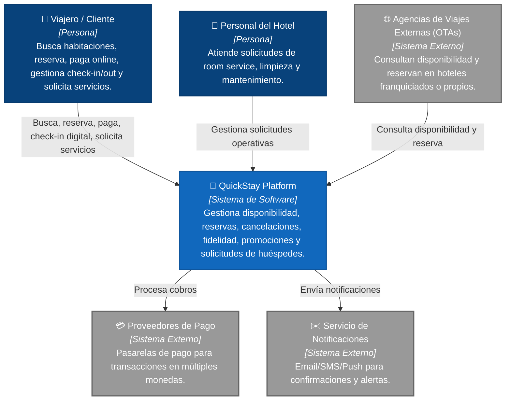
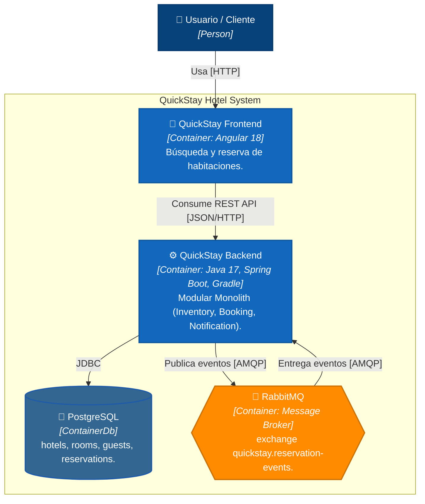
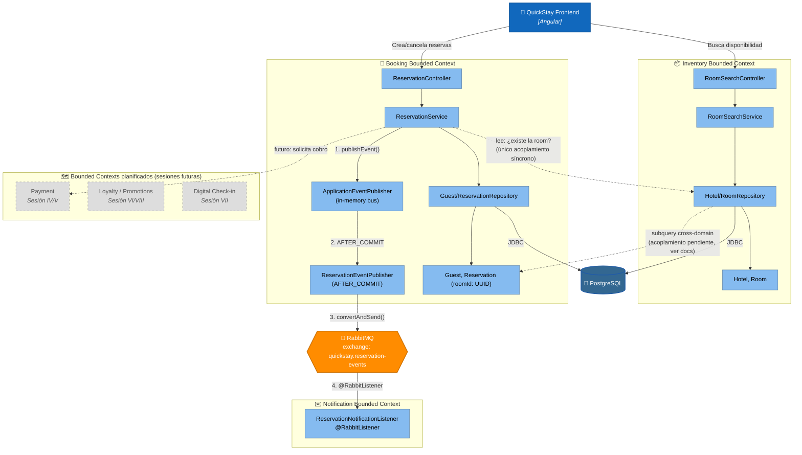

# QuickStay Hotel Platform

## 🎯 Objetivo de la kata
Desarrollar una plataforma de reservas hoteleras que permita buscar disponibilidad,
reservar, pagar, gestionar check-in/out digital y recibir promociones — evolucionando
progresivamente su arquitectura a lo largo de las 8 sesiones del módulo
*Microservices, Event-Driven and Cloud-Native*.

---

# 1era Actividad — Choose a Software Architecture Kata
**QuickStay Hotel Platform**

## Description
A hotel group wants to create a booking platform for its hotels. Customers can search
availability, reserve rooms, pay online, check in digitally, request services, and
receive promotions.

## Users
Potentially millions of travelers across regions.

## Requirements
- Allow users to search rooms by location, date, price, and amenities.
- Allow users to reserve a room.
- Allow users to pay online or at the hotel.
- Allow users to cancel or modify reservations.
- Support loyalty points.
- Support national promotions.
- Support hotel-specific promotions.
- Allow digital check-in and check-out.
- Allow users to request room service, housekeeping, or maintenance.
- Notify customers about booking confirmation, reminders, and changes.
- Integrate with external travel agencies.
- Integrate with payment providers.
- Support mobile access.

## Additional Context
- Some hotels are owned by the company; others are franchises.
- Room availability changes constantly.
- Third-party booking platforms may reserve rooms too.
- Overbooking must be avoided or carefully managed.
- Cancellations may have different policies.
- Future expansion includes multiple countries and currencies.

---

# 2da Actividad — Build the Monolith Core (Sesión II)

Se construyó un **monolito en capas** puro (separado por rol técnico:
presentation → service → repository → domain), sin separación por dominio
de negocio todavía. Ese fue el punto de partida intencional — ver el
refactor hacia dominios en la Sesión III, más abajo.

### Alcance funcional (sigue vigente)
- ✅ Búsqueda de disponibilidad por ciudad, fechas y precio máximo
- ✅ Reserva de habitación con validación de solapamiento (anti-overbooking
  básico, dentro de una única transacción)
- ✅ Cancelación de reserva
- ✅ Alta automática de huésped al reservar
- ⏳ Pago online, loyalty, promociones, check-in digital, notificaciones,
  integración con OTAs → planificado para sesiones posteriores

---

# 3ra Actividad — Structural Variation Styles (Sesión III)

**Actividades:** *Conduct an architectural review of the initial monolith*
+ *Refactor the code into strict domain packages/namespaces*.

Ver el detalle completo de la revisión y las decisiones de diseño en
[`docs/session-03-evaluation.md`](docs/session-03-evaluation.md).

## 🏛️ Arquitectura actual: Modular Monolith (Bounded Contexts)

El código se reorganizó de capas técnicas a **paquetes por dominio de
negocio**. Sigue siendo un único deployable con una única base de datos
(todavía no es microservicios), pero cada dominio ya es internamente
cohesivo y sus límites están explícitos en el código.

```
quickstay-hotel-platform/
├── backend/                          Spring Boot (Java 17, Gradle Groovy)
│   └── src/main/java/com/quickstay/
│       ├── inventory/                Bounded Context: Hoteles y habitaciones
│       │   ├── domain/       Hotel, Room, HotelOwnershipType
│       │   ├── repository/   HotelRepository, RoomRepository
│       │   ├── service/      RoomSearchService
│       │   ├── web/          RoomSearchController
│       │   └── dto/          RoomSearchRequest, RoomAvailabilityResponse
│       │
│       ├── booking/                  Bounded Context: Huéspedes y reservas
│       │   ├── domain/       Guest, Reservation, ReservationStatus
│       │   ├── repository/   GuestRepository, ReservationRepository
│       │   ├── service/      ReservationService
│       │   ├── web/          ReservationController
│       │   ├── dto/          ReservationRequest, ReservationResponse
│       │   └── exception/    RoomNotAvailableException
│       │
│       └── shared/                   Cross-cutting
│           └── exception/    GlobalExceptionHandler
│
├── frontend/quickstay-web/           Angular 18 (standalone components) — sin cambios
├── infra/                            docker-compose (PostgreSQL) — sin cambios
└── docs/
    ├── session-02-evaluation.md
    └── session-03-evaluation.md      Revisión arquitectónica + justificación del refactor
```

### Cambio de diseño clave
`Reservation` ya **no** mapea `Room` como relación JPA (`@ManyToOne`) —
ahora guarda solo `roomId: UUID`. Esto evita que el dominio Booking cargue
por accidente el grafo de entidades de Inventory, preservando el límite del
Bounded Context aunque ambas tablas sigan en la misma base de datos física.
Detalle completo en `docs/session-03-evaluation.md`.

### Principios de esta sesión
- **Bounded Contexts explícitos en el código**, no solo en la cabeza del
  equipo.
- **Un solo deployable y una sola base de datos** — la modularización es de
  código, todavía no de infraestructura (eso empieza en Sesión VI).
- Acoplamiento cross-dominio que queda **documentado como decisión
  consciente**, no eliminado del todo (se resuelve con eventos en Sesión IV
  y CQRS en Sesión VIII).

---

# 4ta Actividad — Enterprise Integration & Messaging (Sesión IV)

**Actividades:** *Map Out Domain Events* + *Wire an In-Memory Event Bus* +
*Refactor the event bus to use an external message broker (RabbitMQ)*.

Ver el detalle completo en:
- [`docs/session-04-domain-events.md`](docs/session-04-domain-events.md) — catálogo de eventos
- [`docs/session-04-evaluation.md`](docs/session-04-evaluation.md) — evaluación arquitectónica

## 🔀 De llamada síncrona a mensajería asíncrona

Nace el Bounded Context **Notification**. Booking ya no lo conocería aunque
quisiera: se comunican exclusivamente a través de RabbitMQ.

```
booking/
├── event/                 Domain events internos (in-memory)
│   ├── ReservationConfirmedEvent
│   └── ReservationCancelledEvent
└── messaging/              Infraestructura: traduce domain event → mensaje externo
    ├── ReservationIntegrationEvent   (contrato de mensaje, wire format)
    ├── BookingMessagingConfig        (declara el exchange RabbitMQ)
    └── ReservationEventPublisher     (@TransactionalEventListener AFTER_COMMIT)

notification/
└── messaging/
    ├── ReservationEventMessage       (copia propia del contrato — sin importar booking)
    ├── NotificationMessagingConfig   (declara su propia cola + binding)
    └── ReservationNotificationListener (@RabbitListener — logea la "notificación")

shared/
└── messaging/
    └── RabbitMqConfig                (converter JSON compartido)
```

### Flujo
1. `ReservationService.reserve()` guarda la reserva y publica
   `ReservationConfirmedEvent` en memoria (bus de Spring).
2. `ReservationEventPublisher` escucha ese evento, pero solo actúa
   **después de que la transacción confirma** (`AFTER_COMMIT`) — si la
   reserva falla, nunca sale ningún mensaje.
3. El mensaje llega a RabbitMQ, al exchange `quickstay.reservation-events`.
4. `ReservationNotificationListener` (dominio Notification, sin ningún
   import de `booking`) lo consume de su propia cola y "envía" la
   notificación (por ahora, solo logging — el canal real de email/SMS
   queda fuera de alcance de este módulo).

### Por qué el cliente HTTP no espera la notificación
La reserva se confirma y responde `201 Created` de inmediato. La
notificación llega con **consistencia eventual** — normalmente milisegundos
después, pero desacoplada del tiempo de respuesta de la API. Detalle
completo del trade-off en `docs/session-04-evaluation.md`.

---

## 📦 Tecnologías

| Capa | Tecnología |
|------|------------|
| **Backend** | Java 17, Spring Boot 3.3.2, Gradle 8.8 (Groovy DSL), Spring Data JPA, Spring AMQP, Flyway, Lombok, PostgreSQL driver |
| **Mensajería** | RabbitMQ 3 (management UI incluida) |
| **Frontend** | Angular 18 (standalone components), TypeScript, SCSS |
| **Base de datos** | PostgreSQL 16 (Docker) |
| **Gestión de dependencias** | Gradle (backend) & npm (frontend) |
| **Control de versiones** | Git — rama + tag por sesión |

---

# 🏨 Arquitectura de Software (C4 Model)

## 📌 Nivel 1: Diagrama de Contexto



> Los sistemas externos (OTAs, pagos, notificaciones) representan el estado
> **objetivo** de QuickStay. Estado real a Sesión IV: **Notification** ya
> existe como Bounded Context interno y consume eventos de Booking de forma
> asíncrona (ver Nivel 3), pero el canal final hacia el huésped (envío real
> de email/SMS/push, el sistema externo de este diagrama) todavía es un
> stub que solo loguea — no hay integración real con un proveedor. OTAs y
> Proveedores de Pago siguen sin integración alguna (roadmap Sesión V+).

## 📦 Nivel 2: Diagrama de Contenedores (Sesión IV)



> Nota: el backend aparece publicando **y** consumiendo del broker porque,
> al ser todavía un monolito, tanto Booking (publisher) como Notification
> (consumer) corren dentro del mismo proceso/container. Cuando Notification
> se extraiga a su propio servicio (Sesión VI+), este diagrama pasaría a
> tener dos containers de aplicación distintos conectados por RabbitMQ, en
> vez de uno solo hablándose a sí mismo.

## 🧩 Nivel 3: Diagrama de Componentes — Bounded Contexts + Messaging (Sesión IV)



---

## 🚀 Cómo levantar el entorno local

### 1. Infraestructura (PostgreSQL + RabbitMQ vía Docker)

> Nota: si ya tenés un PostgreSQL nativo corriendo en tu máquina (Windows/Mac),
> puede ocupar el puerto 5432. Este proyecto usa el puerto **5433** en el host
> para evitar ese conflicto (ver `infra/docker-compose.yml`).

```bash
cd infra
docker compose up -d
docker ps   # confirmar que quickstay-postgres, pgadmin y quickstay-rabbitmq están Up
```

Credenciales:
- PostgreSQL: DB `quickstay`, user/pass `quickstay`/`quickstay` (puerto 5433)
- RabbitMQ: user/pass `quickstay`/`quickstay` (puerto 5672 AMQP, 15672 management UI)

Management UI de RabbitMQ: `http://localhost:15672` — útil para ver el
exchange `quickstay.reservation-events` y la cola
`notification.reservation-events` en tiempo real.

### 2. Backend

```bash
cd backend
./gradlew bootRun        # Windows: .\gradlew.bat bootRun
```

Al arrancar, Flyway crea el schema y carga datos demo automáticamente
(`V1__init_schema.sql`, `V2__seed_demo_data.sql`). La API queda en
`http://localhost:8080`.

**Nota:** el proceso queda corriendo en foreground (no "termina" — la barra de
progreso de Gradle se queda fija, eso es normal). Confirmá que levantó bien
buscando en el log: `Started QuickstayApplication in X seconds`.

Endpoints disponibles:
```
GET  /api/rooms/search?city={city}&checkIn={yyyy-MM-dd}&checkOut={yyyy-MM-dd}&maxPrice={decimal}
POST /api/reservations
POST /api/reservations/{id}/cancel
```

Ejemplo:
```
http://localhost:8080/api/rooms/search?city=La%20Paz&checkIn=2026-09-01&checkOut=2026-09-05&maxPrice=600
```

### 3. Frontend

```bash
cd frontend/quickstay-web
npm install
npm start
```

Se levanta en `http://localhost:4200`, ya conectado al backend
(`src/environments/environment.ts`).

### 4. Verificar

- `http://localhost:4200` → formulario de búsqueda y listado de habitaciones
  disponibles, con opción de reservar.
- `http://localhost:8080/api/rooms/search?...` → JSON con habitaciones (ver
  ejemplo arriba).

---

## 🧪 Troubleshooting rápido

| Síntoma | Causa probable | Solución |
|---|---|---|
| `FATAL: la autentificación password falló` | Volumen de Postgres viejo con otras credenciales, o conflicto de puerto con un Postgres nativo | `docker compose down -v && docker compose up -d` |
| `Unable to determine Dialect without JDBC metadata` | Backend no logra conectar a la DB (mensaje real de Hibernate queda oculto) | Verificar `docker ps` y el puerto en `application.yml` |
| Barra de Gradle se queda en 80-90% | Comportamiento normal de `bootRun` — el proceso queda vivo sirviendo peticiones | Buscar `Started QuickstayApplication` en el log |
| `blocked by CORS policy` en la consola del navegador, request marcado `net::ERR_FAILED` (pero sin error en el log del backend) | El browser bloquea la respuesta porque el backend no declara `http://localhost:4200` como origen permitido | Ya resuelto vía `shared/config/CorsConfig.java` — si cambiás el puerto del frontend, actualizá `allowedOrigins` ahí |
| Backend no arranca: `Connection refused` apuntando a `5672` | RabbitMQ no está corriendo | `docker ps` y confirmar `quickstay-rabbitmq` está `Up`; si no, `docker compose up -d` desde `infra/` |
| No aparece el log `[NOTIFICATION] Enviando email...` tras reservar | El listener no está conectado a la cola, o el mensaje no llegó | Revisar `http://localhost:15672` → pestaña *Queues* → `notification.reservation-events`: si el mensaje quedó "Ready" sin consumir, el backend probablemente no levantó bien el `@RabbitListener` (ver log al arrancar) |

---

## 🗂️ Git — flujo por sesión

```bash
git checkout -b session-02-layered-monolith
git add .
git commit -m "feat: session 02 layered monolith core"
git push -u origin session-02-layered-monolith

git checkout main
git merge --no-ff session-02-layered-monolith -m "merge: session 02 layered monolith core"
git tag -a v0.2-layered-monolith -m "Session II: Layered Monolith Core"
git push origin main --tags
```

Sesión III:

```bash
git checkout -b session-03-modular-monolith
git add .
git commit -m "refactor: reorganize into inventory/booking bounded contexts

- move layered packages into domain-oriented packages (inventory, booking)
- decouple Reservation from Room JPA relation, use roomId reference instead
- document remaining cross-domain coupling in docs/session-03-evaluation.md"
git push -u origin session-03-modular-monolith

git checkout main
git merge --no-ff session-03-modular-monolith -m "merge: session 03 modular monolith (bounded contexts)"
git tag -a v0.3-modular-monolith -m "Session III: Modular Monolith - Bounded Contexts"
git push origin main --tags
```

Sesión IV:

```bash
git checkout -b session-04-messaging
git add .
git commit -m "feat: event-driven communication between Booking and Notification

- add ReservationConfirmedEvent/ReservationCancelledEvent domain events
- wire in-memory event bus via Spring ApplicationEventPublisher
- add RabbitMQ (docker-compose) and Spring AMQP
- refactor: publish integration events to RabbitMQ AFTER_COMMIT
- new Notification bounded context consuming via @RabbitListener
- docs: domain event catalog + eventual consistency evaluation"
git push -u origin session-04-messaging

git checkout main
git merge --no-ff session-04-messaging -m "merge: session 04 enterprise integration & messaging"
git tag -a v0.4-messaging -m "Session IV: Enterprise Integration & Messaging"
git push origin main --tags
```

---
