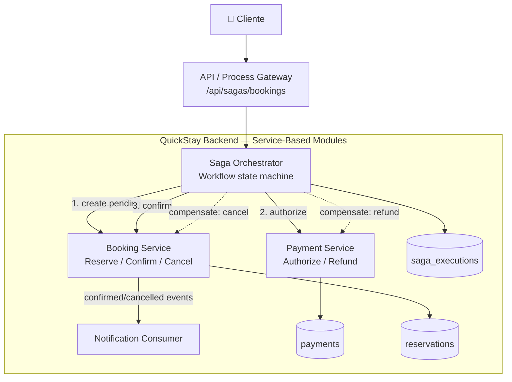

# Session V — Service-Based & Orchestrated Styles

## Objetivo

Implementar un workflow multi-servicio para QuickStay usando **Saga por Orquestación**. El flujo cubre:

1. Booking crea una reserva temporal (`PENDING_PAYMENT`).
2. Payment autoriza el cobro.
3. Booking confirma la reserva.
4. Si Payment falla, Booking ejecuta la acción compensatoria `cancel`.
5. Si Payment ya fue autorizado y falla un paso posterior, Payment ejecuta `refund` y Booking ejecuta `cancel`.

El proyecto sigue siendo un **modular monolith** físicamente, pero los bounded contexts `Booking`, `Payment` y `Saga Orchestrator` tienen contratos y responsabilidades separadas. Esto permite evolucionarlos posteriormente a servicios desplegables independientes sin cambiar el concepto del workflow.

## Arquitectura



## Workflow feliz

```text
STARTED
   |
   v
RESERVATION_CREATED
   |
   v
PAYMENT_AUTHORIZED
   |
   v
COMPLETED
```

## Workflow con fallo parcial

```text
STARTED
   |
   v
RESERVATION_CREATED
   |
   X  Payment rejected
   |
   v
COMPENSATION_COMPLETED
       |
       +--> Booking.cancel()
```

Si el pago ya fue autorizado:

```text
RESERVATION_CREATED
        |
        v
PAYMENT_AUTHORIZED
        |
        X  Booking confirmation fails
        |
        v
COMPENSATION_COMPLETED
        |
        +--> Payment.refund()
        +--> Booking.cancel()
```

## API principal

### Ejecutar Booking + Payment como una Saga

`POST /api/sagas/bookings`

```json
{
  "reservation": {
    "roomId": "33333333-3333-3333-3333-333333333333",
    "guestFullName": "Ana Perez",
    "guestEmail": "ana@example.com",
    "checkIn": "2026-09-01",
    "checkOut": "2026-09-05"
  },
  "paymentAmount": 1400.00,
  "failPayment": false
}
```

`paymentAmount` representa el total de la estadía. En el frontend se calcula como `pricePerNight × noches`.

### Probar compensación automática

Enviar exactamente el mismo payload con:

```json
"failPayment": true
```

El Payment Service crea un intento fallido, el Orchestrator captura la excepción y ejecuta `Booking.cancel()`. La respuesta queda con `sagaStatus = COMPENSATED`.

### Consultar una Saga

`GET /api/sagas/bookings/{sagaId}`

Permite inspeccionar el estado persistido de la máquina de estados, el paso actual y el último error.

## Estados y consistencia

| Componente | Estado local | Acción compensatoria |
|---|---|---|
| Booking | `PENDING_PAYMENT` → `CONFIRMED` | `CANCELLED` |
| Payment | `AUTHORIZED` | `REFUNDED` |
| Saga | `STARTED` → `COMPLETED` | `COMPENSATED` |

La consistencia es **eventual y basada en acciones compensatorias**, no en una transacción distribuida ACID entre Booking y Payment.

## Decisiones de diseño

- **Orchestration en lugar de Choreography:** un único componente conoce el orden del workflow, lo que hace más sencillo observar, probar y compensar el proceso.
- **Estados persistidos:** `saga_executions` permite auditar el estado y el paso actual del proceso.
- **Idempotencia básica:** Payment no crea otro pago para una misma reserva si ya existe uno.
- **Compensación explícita:** `cancel` y `refund` son operaciones de negocio, no simples rollbacks de base de datos.
- **Fallos parciales:** Payment puede fallar después de que Booking ya creó la reserva; la reserva no queda ocupando la habitación indefinidamente.
- **Separación de responsabilidades:** Booking no conoce Payment; Payment no conoce Booking; el Orchestrator coordina ambos.
- **Preparado para extracción:** aunque los módulos viven hoy en el mismo proceso, sus límites facilitan convertirlos posteriormente en `booking-service`, `payment-service` y `saga-orchestrator` independientes.

## Evidencia de la actividad

La UI de Angular incorpora un checkbox **"Simular fallo de pago"**. Esto permite demostrar de forma visible los dos escenarios solicitados por la unidad:

1. **Happy path:** Booking → Payment → Booking confirmation.
2. **Partial failure:** Booking → Payment failure → automatic compensation.

La implementación extiende la mensajería de la Sesión IV sin eliminar RabbitMQ ni los eventos de Notification.
